<p align="center">
  
</p>

<p align="center">
  <a href="https://www.python.org/downloads/">
    
  </a>
  <a href="LICENSE">
    
  </a>
  <a href="https://discord.massgen.ai">
    
  </a>
</p>

<h1 align="center">🚀 MassGen: Multi-Agent Scaling System for GenAI</h1>

<p align="center">
  <i>MassGen is a cutting-edge multi-agent system that leverages the power of collaborative AI to solve complex tasks.</i>
</p>

<p align="center">
  <a href="https://www.youtube.com/watch?v=Dp2oldJJImw">
    
  </a>
</p>

<p align="center">
  <i>Multi-agent scaling through intelligent collaboration in Grok Heavy style</i>
</p>

MassGen is a cutting-edge multi-agent system that leverages the power of collaborative AI to solve complex tasks. It assigns a task to multiple AI agents who work in parallel, observe each other's progress, and refine their approaches to converge on the best solution to deliver a comprehensive and high-quality result. The power of this "parallel study group" approach is exemplified by advanced systems like xAI's Grok Heavy and Google DeepMind's Gemini Deep Think.

This project started with the "threads of thought" and "iterative refinement" ideas presented in [The Myth of Reasoning](https://docs.ag2.ai/latest/docs/blog/2025/04/16/Reasoning/), and extends the classic "multi-agent conversation" idea in [AG2](https://github.com/ag2ai/ag2). Here is a [video recording](https://www.youtube.com/watch?v=xM2Uguw1UsQ) of the background context introduction presented at the Berkeley Agentic AI Summit 2025.

---

## 📋 Table of Contents

<details open>
<summary><h3>✨ Key Features</h3></summary>

- [Cross-Model/Agent Synergy](#-key-features-1)
- [Parallel Processing](#-key-features-1)  
- [Intelligence Sharing](#-key-features-1)
- [Consensus Building](#-key-features-1)
- [Live Visualization](#-key-features-1)
</details>

<details open>
<summary><h3>🏗️ System Design</h3></summary>

- [System Architecture](#%EF%B8%8F-system-design-1)
- [Parallel Processing](#%EF%B8%8F-system-design-1)
- [Real-time Collaboration](#%EF%B8%8F-system-design-1)
- [Convergence Detection](#%EF%B8%8F-system-design-1)
- [Adaptive Coordination](#%EF%B8%8F-system-design-1)
</details>

<details open>
<summary><h3>🚀 Quick Start</h3></summary>

- [📥 Installation](#1--installation)
- [🔐 API Configuration](#2--api-configuration)
- [🧩 Supported Models and Tools](#3--supported-models-and-tools)
  - [Models](#models)
  - [Tools](#tools)
- [🏃 Run MassGen](#4--run-massgen)
  - [Quick Test with A Single Model](#quick-test-with-a-single-model)
  - [Multiple Agents from Config](#multiple-agents-from-config)
  - [CLI Configuration Parameters](#cli-configuration-parameters)
  - [Configuration File Format](#configuration-file-format)
  - [Interactive Multi-Turn Mode](#interactive-multi-turn-mode)
- [📊 View Results](#5--view-results)
  - [Real-time Display](#real-time-display)
  - [Comprehensive Logging](#comprehensive-logging)
</details>

<details open>
<summary><h3>💡 Examples</h3></summary>

- [📚 Case Studies](#case-studies)
- [❓ Question Answering](#1--question-answering)
- [🧠 Creative Writing](#2--creative-writing)
- [🔬 Research](#3-research)
</details>

<details open>
<summary><h3>🗺️ Roadmap</h3></summary>

- Recent Achievements
  - [v0.0.21](#recent-achievements-v0021)
  - [v0.0.3 - v0.0.20](#previous-achievements-v003-v0020)
- [Key Future Enhancements](#key-future-enhancements)
  - Advanced Agent Collaboration
  - Expanded Model, Tool & Agent Integrations
  - Improved Performance & Scalability
  - Enhanced Developer Experience
  - Web Interface
- [v0.0.22 Roadmap](#v0022-roadmap)
</details>

<details open>
<summary><h3>📚 Additional Resources</h3></summary>

- [🤝 Contributing](#-contributing)
- [📄 License](#-license)
- [⭐ Star History](#-star-history)
</details>

---

## ✨ Key Features

| Feature | Description |
|---------|-------------|
| **🤝 Cross-Model/Agent Synergy** | Harness strengths from diverse frontier model-powered agents |
| **⚡ Parallel Processing** | Multiple agents tackle problems simultaneously |
| **👥 Intelligence Sharing** | Agents share and learn from each other's work |
| **🔄 Consensus Building** | Natural convergence through collaborative refinement |
| **📊 Live Visualization** | See agents' working processes in real-time |

---

## 🏗️ System Design

MassGen operates through an architecture designed for **seamless multi-agent collaboration**:

```mermaid
graph TB
    O[🚀 MassGen Orchestrator<br/>📋 Task Distribution & Coordination]

    subgraph Collaborative Agents
        A1[Agent 1<br/>🏗️ Anthropic/Claude + Tools]
        A2[Agent 2<br/>🌟 Google/Gemini + Tools]
        A3[Agent 3<br/>🤖 OpenAI/GPT + Tools]
        A4[Agent 4<br/>⚡ xAI/Grok + Tools]
    end

    H[🔄 Shared Collaboration Hub<br/>📡 Real-time Notification & Consensus]

    O --> A1 & A2 & A3 & A4
    A1 & A2 & A3 & A4 <--> H

    classDef orchestrator fill:#e1f5fe,stroke:#0288d1,stroke-width:3px
    classDef agent fill:#f3e5f5,stroke:#7b1fa2,stroke-width:2px
    classDef hub fill:#e8f5e8,stroke:#388e3c,stroke-width:2px

    class O orchestrator
    class A1,A2,A3,A4 agent
    class H hub
```



The system's workflow is defined by the following key principles:

**Parallel Processing** - Multiple agents tackle the same task simultaneously, each leveraging their unique capabilities (different models, tools, and specialized approaches).

**Real-time Collaboration** - Agents continuously share their working summaries and insights through a notification system, allowing them to learn from each other's approaches and build upon collective knowledge.

**Convergence Detection** - The system intelligently monitors when agents have reached stability in their solutions and achieved consensus through natural collaboration rather than forced agreement.

**Adaptive Coordination** - Agents can restart and refine their work when they receive new insights from others, creating a dynamic and responsive problem-solving environment.

This collaborative approach ensures that the final output leverages collective intelligence from multiple AI systems, leading to more robust and well-rounded results than any single agent could achieve alone.

---

## 🚀 Quick Start

### 1. 📥 Installation

**Core Installation:**
```bash
git clone https://github.com/Leezekun/MassGen.git
cd MassGen

pip install uv
uv venv

```

**Optional CLI Tools** (for enhanced capabilities):
```bash
# Claude Code CLI - Advanced coding assistant
npm install -g @anthropic-ai/claude-code

# LM Studio - Local model inference
# For MacOS/Linux
sudo ~/.lmstudio/bin/lms bootstrap
# For Windows
cmd /c %USERPROFILE%/.lmstudio/bin/lms.exe bootstrap
```

### 2. 🔐 API Configuration

Using the template file `.env.example` to create a `.env` file in the `massgen` directory with your API keys. Note that only the API keys of the models used by your MassGen agent team is needed.

```bash
# Copy example configuration
cp .env.example .env
```

**Useful links to get API keys:**
 - [Azure OpenAI](https://learn.microsoft.com/en-us/azure/ai-services/openai/)
 - [Cerebras](https://inference-docs.cerebras.ai/introduction)
 - [Claude](https://docs.anthropic.com/en/api/overview)
 - [Gemini](https://ai.google.dev/gemini-api/docs)
 - [Grok](https://docs.x.ai/docs/overview)
 - [Kimi/Moonshot](https://platform.moonshot.ai/)
 - [OpenAI](https://platform.openai.com/api-keys)
 - [Z AI](https://docs.z.ai/guides/overview/quick-start)

### 3. 🧩 Supported Models and Tools

#### Models

The system currently supports multiple model providers with advanced capabilities:

**API-based Models:**
- **Azure OpenAI** (NEW in v0.0.10): GPT-4, GPT-4o, GPT-3.5-turbo, GPT-4.1, GPT-5-chat
- **Cerebras AI**: GPT-OSS-120B...
- **Claude**: Claude Haiku 3.5, Claude Sonnet 4, Claude Opus 4...
- **Claude Code**: Native Claude Code SDK with comprehensive dev tools
- **Gemini**: Gemini 2.5 Flash, Gemini 2.5 Pro...
- **Grok**: Grok-4, Grok-3, Grok-3-mini...
- **OpenAI**: GPT-5 series (GPT-5, GPT-5-mini, GPT-5-nano)...
- **Together AI**, **Fireworks AI**, **Groq**, **Kimi/Moonshot**, **Nebius AI Studio**, **OpenRouter**: LLaMA, Mistral, Qwen...
- **Z AI**: GLM-4.5

**Local Model Support (NEW in v0.0.7):**
- **LM Studio**: Run open-weight models locally with automatic server management
  - Automatic LM Studio CLI installation
  - Auto-download and loading of models
  - Zero-cost usage reporting
  - Support for LLaMA, Mistral, Qwen and other open-weight models

More providers and local inference engines (vllm, sglang) are welcome to be added.

#### Tools

MassGen agents can leverage various tools to enhance their problem-solving capabilities. Both API-based and CLI-based backends support different tool capabilities.

**Supported Built-in Tools by Backend:**

| Backend | Live Search | Code Execution | File Operations | MCP Support | Advanced Features |
|---------|:-----------:|:--------------:|:---------------:|:-----------:|:-----------------|
| **Azure OpenAI** (NEW in v0.0.10) | ❌ | ❌ | ❌ | ❌ | Code interpreter, Azure deployment management |
| **Claude API**  | ✅ | ✅ | ✅ | ✅ | Web search, code interpreter, **MCP integration** |
| **Claude Code** | ✅ | ✅ | ✅ | ✅ | **Native Claude Code SDK, comprehensive dev tools, MCP integration** |
| **Gemini API** | ✅ | ✅ | ✅ | ✅ | Web search, code execution, **MCP integration**|
| **Grok API** | ✅ | ❌ | ✅ | ✅ | Web search, **MCP integration** |
| **OpenAI API** | ✅ | ✅ | ✅ | ✅ | Web search, code interpreter, **MCP integration** |
| **ZAI API** | ❌ | ❌ | ✅ | ✅ | **MCP integration** |

### 4. 🏃 Run MassGen

#### 🚀 Getting Started

**1. Single Agent (Easiest Start)**
```bash
# Quick test with any supported model - no configuration needed
uv run python -m massgen.cli --model claude-3-5-sonnet-latest "What is machine learning?"
uv run python -m massgen.cli --model gemini-2.5-flash "Explain quantum computing"
uv run python -m massgen.cli --model gpt-5-nano "Summarize the latest AI developments"
```
→ [See all single agent configs](massgen/configs/basic/single/)

**2. Multi-Agent Collaboration (Recommended)**
```bash
# Three powerful agents working together - Gemini, GPT-5, and Grok
uv run python -m massgen.cli --config basic/multi/three_agents_default.yaml "Analyze the pros and cons of renewable energy"
```

**This showcases MassGen's core strength:**
- **Gemini 2.5 Flash** - Fast research with web search
- **GPT-5 Nano** - Advanced reasoning with code execution
- **Grok-3 Mini** - Real-time information and alternative perspectives

→ [Explore more multi-agent setups](massgen/configs/basic/multi/)

#### 🆕 Latest Features (v0.0.21)

**Advanced Filesystem Permissions & Grok MCP Integration**
```bash
# Grok with MCP tools for weather, search, and more
uv run python -m massgen.cli --config tools/mcp/grok3_mini_mcp_example.yaml "What's the weather in Tokyo and compare it to Paris?"

# Multi-agent file collaboration with permission control
uv run python -m massgen.cli --config tools/filesystem/claude_code_context_sharing.yaml "Analyze this codebase and suggest improvements"

# Advanced filesystem permissions for secure collaboration
uv run python -m massgen.cli --config tools/filesystem/fs_permissions_test.yaml "Review and refactor project files safely"
```

**What's New in v0.0.21:**
- **Grok MCP Support** - Full MCP integration with automatic filesystem support
- **Advanced Permissions** - Granular file access control for multi-agent collaboration
- **Context Sharing** - Claude Code agents can now share workspace snapshots

**Try v0.0.21 Features Now:**
```bash
# Grok with MCP tools - weather, search, and more
uv run python -m massgen.cli --config tools/mcp/grok3_mini_mcp_example.yaml "What's the weather in Tokyo and how does it compare to London? Also tell me about any interesting events happening in both cities this week."

# Multi-agent file collaboration with permission control
uv run python -m massgen.cli --config tools/filesystem/fs_permissions_test.yaml "Analyze all Python files in this project, identify potential security issues, and create a detailed report with recommendations for improvements."

# Context sharing between Claude Code agents
uv run python -m massgen.cli --config tools/filesystem/claude_code_context_sharing.yaml "Create a comprehensive website about fascinating facts regarding large language models. Put everything in a single index.html file with embedded CSS and make it visually appealing."
```

→ [See all release examples](massgen/configs/README.md#release-history--examples)

#### Additional Examples by Provider

**Claude (Recursive MCP Execution - v0.0.20+)**
```bash
# Claude with advanced tool chaining
uv run python -m massgen.cli --config tools/mcp/claude_mcp_example.yaml "Research and compare weather in multiple cities"
```

**OpenAI (GPT-5 Series with MCP - v0.0.17+)**
```bash
# GPT-5 with weather and external tools
uv run python -m massgen.cli --config tools/mcp/gpt5_mini_mcp_example.yaml "Plan a weekend trip based on weather forecasts"
```

**Gemini (Multi-Server MCP - v0.0.15+)**
```bash
# Gemini with multiple MCP services (Airbnb + Search)
uv run python -m massgen.cli --config tools/mcp/multimcp_gemini.yaml "Find accommodations in Paris with neighborhood analysis"
```

**Claude Code (Development Tools)**
```bash
# Professional development environment
uv run python -m massgen.cli --backend claude_code --model sonnet "Create a Flask web app with authentication"
```

**Local Models (LM Studio - v0.0.7+)**
```bash
# Run open-source models locally
uv run python -m massgen.cli --config providers/local/lmstudio.yaml "Explain machine learning concepts"
```

→ [Browse by provider](massgen/configs/providers/) | [Browse by tools](massgen/configs/tools/) | [Browse teams](massgen/configs/teams/)

#### Real-World Use Cases

**Question Answering & Research:**
```bash
# Complex research with multiple perspectives
uv run python -m massgen.cli --config basic/multi/gemini_4o_claude.yaml "What's best to do in Stockholm in October 2025"

# Specific research requirements
uv run python -m massgen.cli --config basic/multi/gemini_4o_claude.yaml "Give me all the talks on agent frameworks in Berkeley Agentic AI Summit 2025"
```

**Creative Writing:**
```bash
# Story generation with multiple creative agents
uv run python -m massgen.cli --config basic/multi/gemini_4o_claude.yaml "Write a short story about a robot who discovers music"
```

**Development & Coding:**
```bash
# Full-stack development with file operations
uv run python -m massgen.cli --config tools/filesystem/claude_code_single.yaml "Create a Flask web app with user authentication and database integration"

# Multi-agent code review and testing
uv run python -m massgen.cli --config tools/filesystem/claude_code_flash2.5_gptoss.yaml "Debug and optimize this React application, then write comprehensive tests"
```

**Web Automation:**
```bash
# Browser automation with screenshots and reporting
uv run python -m massgen.cli --config tools/code-execution/multi_agent_playwright_automation.yaml "Browse https://github.com/Leezekun/MassGen and suggest improvements. Include screenshots in a PDF"

# Data extraction and analysis
uv run python -m massgen.cli --config tools/code-execution/multi_agent_playwright_automation.yaml "Navigate to https://news.ycombinator.com, extract the top 10 stories, and create a summary report"
```

→ [**See detailed case studies**](docs/case_studies/README.md) with real session logs and outcomes

#### Interactive Mode & Advanced Usage

**Multi-Turn Conversations:**
```bash
# Start interactive chat (no initial question)
uv run python -m massgen.cli --config basic/multi/three_agents_default.yaml

# Debug mode for troubleshooting
uv run python -m massgen.cli --config basic/multi/three_agents_default.yaml --debug "Your question"
```

## Configuration Files

MassGen configurations are organized by features and use cases. See the [Configuration Guide](massgen/configs/README.md) for detailed organization and examples.

**Quick navigation:**
- **Basic setups**: [Single agent](massgen/configs/basic/single/) | [Multi-agent](massgen/configs/basic/multi/)
- **Tool integrations**: [MCP servers](massgen/configs/tools/mcp/) | [Web search](massgen/configs/tools/web-search/) | [Filesystem](massgen/configs/tools/filesystem/)
- **Provider examples**: [OpenAI](massgen/configs/providers/openai/) | [Claude](massgen/configs/providers/claude/) | [Gemini](massgen/configs/providers/gemini/)
- **Specialized teams**: [Creative](massgen/configs/teams/creative/) | [Research](massgen/configs/teams/research/) | [Development](massgen/configs/teams/development/)

See MCP server setup guides: [Discord MCP](massgen/configs/docs/DISCORD_MCP_SETUP.md) | [Twitter MCP](massgen/configs/docs/TWITTER_MCP_ENESCINAR_SETUP.md) 

#### CLI Configuration Parameters

| Parameter          | Description |
|-------------------|-------------|
| `--config`         | Path to YAML configuration file with agent definitions, model parameters, backend parameters and UI settings |
| `--backend`        | Backend type for quick setup without a config file (`claude`, `claude_code`, `gemini`, `grok`, `openai`, `azure_openai`, `zai`). Optional for [models with default backends](massgen/utils.py).|
| `--model`          | Model name for quick setup (e.g., `gemini-2.5-flash`, `gpt-5-nano`, ...). `--config` and `--model` are mutually exclusive - use one or the other. |
| `--system-message` | System prompt for the agent in quick setup mode. If `--config` is provided, `--system-message` is omitted. |
| `--no-display`     | Disable real-time streaming UI coordination display (fallback to simple text output).|
| `--no-logs`        | Disable real-time logging.|
| `--debug`          | Enable debug mode with verbose logging (NEW in v0.0.13). Shows detailed orchestrator activities, agent messages, backend operations, and tool calls. Debug logs are saved to `agent_outputs/log_{time}/massgen_debug.log`. |
| `"<your question>"`         | Optional single-question input; if omitted, MassGen enters interactive chat mode. |

#### Configuration File Format

MassGen supports YAML/JSON configuration files with the following structure. See the [Configuration Guide](massgen/configs/README.md) for organized examples:

**Single Agent Configuration:**

Use the `agent` field to define a single agent with its backend and settings:

```yaml
agent: 
  id: "<agent_name>"
  backend:
    type: "azure_openai" | "chatcompletion" | "claude" | "claude_code" | "gemini" | "grok" | "openai" | "zai" | "lmstudio" #Type of backend 
    model: "<model_name>" # Model name
    api_key: "<optional_key>"  # API key for backend. Uses env vars by default.
  system_message: "..."    # System Message for Single Agent
```

**Multi-Agent Configuration:**

Use the `agents` field to define multiple agents, each with its own backend and config:

```yaml
agents:  # Multiple agents (alternative to 'agent')
  - id: "<agent1 name>"
    backend: 
      type: "azure_openai" | "chatcompletion" | "claude" | "claude_code" | "gemini" | "grok" | "openai" |  "zai" | "lmstudio" #Type of backend
      model: "<model_name>" # Model name
      api_key: "<optional_key>"  # API key for backend. Uses env vars by default.
    system_message: "..."    # System Message for Single Agent
  - id: "..."
    backend:
      type: "..."
      model: "..."
      ...
    system_message: "..."
```

**Backend Configuration:**

Detailed parameters for each agent's backend can be specified using the following configuration formats:

#### Chatcompletion (v0.0.18+ with MCP Support)

```yaml
backend:
  type: "chatcompletion"
  model: "gpt-oss-120b"  # Model name
  base_url: "https://api.cerebras.ai/v1" # Base URL for API endpoint
  api_key: "<optional_key>"          # API key for backend. Uses env vars by default.
  temperature: 0.7                   # Creativity vs consistency (0.0-1.0)
  max_tokens: 2500                   # Maximum response length
  
  # MCP (Model Context Protocol) servers configuration (v0.0.18+)
  mcp_servers:
    # Weather server
    weather:
      type: "stdio"
      command: "npx"
      args: ["-y", "@fak111/weather-mcp"]
    
    # Test server for basic MCP functionality
    test_server:
      type: "stdio"
      command: "python"
      args: ["-u", "-m", "massgen.tests.mcp_test_server"]
    
    # Example streamable-http MCP server
    test_http_server:
      type: "streamable-http"
      url: "http://localhost:5173/sse"  # URL for streamable-http transport
  
  # Tool configuration (MCP tools are auto-discovered)
  allowed_tools:                        # Optional: whitelist specific tools
    - "mcp__weather__get_current_weather"
    - "mcp__test_server__mcp_echo"
    - "mcp__test_server__add_numbers"
  
  exclude_tools:                        # Optional: blacklist specific tools
    - "mcp__test_server__current_time"
```

#### Claude (v0.0.20+ with MCP Support)

```yaml
backend:
  type: "claude"
  model: "claude-sonnet-4-20250514"  # Model name
  api_key: "<optional_key>"          # API key for backend. Uses env vars by default.
  temperature: 0.7                   # Creativity vs consistency (0.0-1.0)
  max_tokens: 2500                   # Maximum response length
  enable_web_search: true            # Web search capability
  enable_code_execution: true        # Code execution capability
  
  # MCP (Model Context Protocol) servers configuration (v0.0.20+)
  mcp_servers:
    # Test server for basic MCP functionality
    test_server:
      type: "stdio"
      command: "python"
      args: ["-u", "-m", "massgen.tests.mcp_test_server"]
    
    # Weather server
    weather:
      type: "stdio"
      command: "npx"
      args: ["-y", "@fak111/weather-mcp"]
    
    # Example streamable-http MCP server
    test_http_server:
      type: "streamable-http"
      url: "http://localhost:5173/sse"  # URL for streamable-http transport
  
  # Tool configuration (MCP tools are auto-discovered)
  allowed_tools:                        # Optional: whitelist specific tools
    - "mcp__test_server__mcp_echo"
    - "mcp__test_server__add_numbers"
    - "mcp__weather__get_current_weather"
  
  exclude_tools:                        # Optional: blacklist specific tools
    - "mcp__test_server__current_time"
```

#### Gemini (v0.0.15+ with MCP Support)

```yaml
backend:
  type: "gemini"
  model: "gemini-2.5-flash"          # Model name
  api_key: "<optional_key>"          # API key for backend. Uses env vars by default.
  temperature: 0.7                   # Creativity vs consistency (0.0-1.0)
  max_tokens: 2500                   # Maximum response length
  enable_web_search: true            # Web search capability
  enable_code_execution: true        # Code execution capability
  
  # MCP (Model Context Protocol) servers configuration (v0.0.15+)
  mcp_servers:
    # Weather server
    weather:
      type: "stdio"
      command: "npx"
      args: ["-y", "@fak111/weather-mcp"]
    
    # Brave Search API server (requires BRAVE_API_KEY in .env)
    brave_search:
      type: "stdio"
      command: "npx"
      args: ["-y", "@modelcontextprotocol/server-brave-search"]
      env:
        BRAVE_API_KEY: "${BRAVE_API_KEY}"
    
    # Airbnb search server
    airbnb:
      type: "stdio"
      command: "npx"
      args: ["-y", "@openbnb/mcp-server-airbnb", "--ignore-robots-txt"]
    
    # Example streamable-http MCP server
    test_http_server:
      type: "streamable-http"
      url: "http://localhost:5173/sse"  # URL for streamable-http transport
  
  # Tool configuration (MCP tools are auto-discovered)
  allowed_tools:                        # Optional: whitelist specific tools
    - "mcp__weather__get_current_weather"
    - "mcp__brave_search__brave_web_search"
    - "mcp__airbnb__airbnb_search"
  
  exclude_tools:                        # Optional: blacklist specific tools
    - "mcp__airbnb__debug_mode"
```

#### Grok (v0.0.21+ with MCP Support)

```yaml
backend:
  type: "grok"
  model: "grok-3-mini"               # Model name
  api_key: "<optional_key>"          # API key for backend. Uses env vars by default.
  temperature: 0.7                   # Creativity vs consistency (0.0-1.0)
  max_tokens: 2500                   # Maximum response length
  enable_web_search: true            # Web search capability (uses default: mode="auto", return_citations=true)
  cwd: "workspace"                   # Working directory for automatic filesystem MCP support (NEW in v0.0.21)

  # MCP (Model Context Protocol) servers configuration (v0.0.21+)
  mcp_servers:
    # Weather server
    weather:
      type: "stdio"
      command: "npx"
      args: ["-y", "@fak111/weather-mcp"]
  # OR manually specify search parameters via extra_body (conflicts with enable_web_search):
  # extra_body:
  #   search_parameters:
  #     mode: "auto"                 # Search strategy (see Grok API docs for valid values)
  #     return_citations: true       # Include search result citations 
```

#### Azure OpenAI

```yaml
backend:
  type: "azure_openai"
  model: "gpt-4.1"                     # Azure OpenAI deployment name
  base_url: "https://your-resource.openai.azure.com/"  # Azure OpenAI endpoint
  api_key: "<optional_key>"          # API key for backend. Uses AZURE_OPENAI_API_KEY env var by default.
  api_version: "2024-02-15-preview" # Azure OpenAI API version
  temperature: 0.7                   # Creativity vs consistency (0.0-1.0)
  max_tokens: 2500                   # Maximum response length
  enable_code_interpreter: true      # Code interpreter capability
```

#### OpenAI (v0.0.17+ with MCP Support)

```yaml
backend:
  type: "openai"
  model: "gpt-5-mini"                # Model name
  api_key: "<optional_key>"          # API key for backend. Uses env vars by default.
  temperature: 0.7                   # Creativity vs consistency (0.0-1.0, GPT-5 series models and GPT o-series models don't support this)
  max_tokens: 2500                   # Maximum response length (GPT-5 series models and GPT o-series models don't support this)
  text: 
    verbosity: "medium"              # Response detail level (low/medium/high, only supported in GPT-5 series models)
  reasoning:                         
    effort: "medium"                 # Reasoning depth (low/medium/high, only supported in GPT-5 series models and GPT o-series models)
    summary: "auto"                  # Automatic reasoning summaries (optional)
  enable_web_search: true            # Web search capability - can be used with reasoning
  enable_code_interpreter: true      # Code interpreter capability - can be used with reasoning
  
  # MCP (Model Context Protocol) servers configuration (v0.0.17+)
  mcp_servers:
    # Weather server
    weather:
      type: "stdio"
      command: "npx"
      args: ["-y", "@fak111/weather-mcp"]
    
    # Brave Search API server (requires BRAVE_API_KEY in .env)
    brave_search:
      type: "stdio"
      command: "npx"
      args: ["-y", "@modelcontextprotocol/server-brave-search"]
      env:
        BRAVE_API_KEY: "${BRAVE_API_KEY}"
    
    # Example streamable-http MCP server
    test_http_server:
      type: "streamable-http"
      url: "http://localhost:5173/sse"  # URL for streamable-http transport
  
  # Tool configuration (MCP tools are auto-discovered)
  allowed_tools:                        # Optional: whitelist specific tools
    - "mcp__weather__get_current_weather"
    - "mcp__brave_search__brave_web_search"
  
  exclude_tools:                        # Optional: blacklist specific tools
    - "mcp__weather__debug_mode"
```

#### Claude Code

```yaml
backend:
  type: "claude_code"
  cwd: "claude_code_workspace"  # Working directory for file operations
  api_key: "<optional_key>"          # API key for backend. Uses env vars by default.
  
  # Claude Code specific options
  system_prompt: "" # Custom system prompt to replace default
  append_system_prompt: ""  # Custom system prompt to append
  max_thinking_tokens: 4096                   # Maximum thinking tokens

  # MCP (Model Context Protocol) servers configuration
  mcp_servers:
    # Discord integration server
    discord:
      type: "stdio"                    # Communication type: stdio (standard input/output)
      command: "npx"                    # Command to execute: Node Package Execute
      args: ["-y", "mcp-discord", "--config", "YOUR_DISCORD_TOKEN"]  # Arguments: -y (auto-confirm), mcp-discord package, config with Discord bot token
    
    # Playwright web automation server
    playwright:
      type: "stdio"                    # Communication type: stdio (standard input/output)
      command: "npx"                    # Command to execute: Node Package Execute
      args: [
        "@playwright/mcp@latest",
        "--browser=chrome",              # Use Chrome browser
        "--caps=vision,pdf",             # Enable vision and PDF capabilities
        "--user-data-dir=/tmp/playwright-profile", # Persistent browser profile
        "--save-trace"                 # Save Playwright traces for debugging
      ]
  
  # Tool configuration (Claude Code's native tools)
  allowed_tools:
    - "Read"           # Read files from filesystem
    - "Write"          # Write files to filesystem  
    - "Edit"           # Edit existing files
    - "MultiEdit"      # Multiple edits in one operation
    - "Bash"           # Execute shell commands
    - "Grep"           # Search within files
    - "Glob"           # Find files by pattern
    - "LS"             # List directory contents
    - "WebSearch"      # Search the web
    - "WebFetch"       # Fetch web content
    - "TodoWrite"      # Task management
    - "NotebookEdit"   # Jupyter notebook editing
    # MCP tools (if available), MCP tools will be auto-discovered from the server
    - "mcp__discord__discord_login"
    - "mcp__discord__discord_readmessages"
    - "mcp__playwright"
```

#### ZAI

```yaml
backend:
  type: "zai"
  model: "glm-4.5"  # Model name
  base_url: "https://api.z.ai/api/paas/v4/" # Base URL for API endpoint
  api_key: "<optional_key>"          # API key for backend. Uses env vars by default.
  temperature: 0.7                   # Creativity vs consistency (0.0-1.0)
  top_p: 0.7                    # Nucleus sampling cutoff; keeps smallest set of tokens with cumulative probability ≥ top_p
```

#### LM Studio (NEW in v0.0.7)

```yaml
backend:
  type: "lmstudio"
  model: "qwen2.5-7b-instruct"       # Model to load in LM Studio
  temperature: 0.7                   # Creativity vs consistency (0.0-1.0)
  max_tokens: 2000                   # Maximum response length
```

**UI Configuration:**

Configure how MassGen displays information and handles logging during execution:

```yaml
ui:
  display_type: "rich_terminal" | "terminal" | "simple"  # Display format for agent interactions
  logging_enabled: true | false                          # Enable/disable real-time logging 
```

- `display_type`: Controls the visual presentation of agent interactions
  - `"rich_terminal"`: Full-featured display with multi-region layout, live status updates, and colored output
  - `"terminal"`: Standard terminal display with basic formatting and sequential output
  - `"simple"`: Plain text output without any formatting or special display features
- `logging_enabled`: When `true`, saves detailed timestamp, agent outputs and system status

**Time Control Configuration:**

Configure timeout settings to control how long MassGen's orchestrator can run:

```yaml
timeout_settings:
  orchestrator_timeout_seconds: 30   # Maximum time for orchestration
```

- `orchestrator_timeout_seconds`: Sets the maximum time allowed for the orchestration phase

**Orchestrator Configuration:**

Configure the orchestrator settings for managing agent workspace snapshots and temporary workspaces:

```yaml
orchestrator:
  snapshot_storage: "claude_code_snapshots"        # Directory to store workspace snapshots
  agent_temporary_workspace: "claude_code_temp_workspaces"  # Directory for temporary agent workspaces
```

- `snapshot_storage`: Directory where MassGen saves workspace snapshots for Claude Code agents to share context
- `agent_temporary_workspace`: Directory where temporary agent workspaces are created and managed during collaboration

#### Interactive Multi-Turn Mode

MassGen supports an interactive mode where you can have ongoing conversations with the system:

```bash
# Start interactive mode with a single agent (no tool enabled by default)
uv run python -m massgen.cli --model gpt-5-mini

# Start interactive mode with configuration file
uv run python -m massgen.cli --config basic/multi/three_agents_default.yaml
```

**Interactive Mode Features:**
- **Multi-turn conversations**: Multiple agents collaborate to chat with you in an ongoing conversation
- **Real-time coordination tracking**: Live visualization of agent interactions, votes, and decision-making processes
- **Interactive coordination table**: Press `r` to view complete history of agent coordination events and state transitions
- **Real-time feedback**: Displays real-time agent and system status with enhanced coordination visualization
- **Clear conversation history**: Type `/clear` to reset the conversation and start fresh
- **Easy exit**: Type `/quit`, `/exit`, `/q`, or press `Ctrl+C` to stop

**Watch the recorded demo:**

[](https://www.youtube.com/watch?v=h1R7fxFJ0Zc)

### 5. 📊 View Results

The system provides multiple ways to view and analyze results:

#### Real-time Display
- **Live Collaboration View**: See agents working in parallel through a multi-region terminal display
- **Status Updates**: Real-time phase transitions, voting progress, and consensus building
- **Streaming Output**: Watch agents' reasoning and responses as they develop

**Watch an example here:**

[](https://www.youtube.com/watch?v=Dp2oldJJImw)

#### Comprehensive Logging

All sessions are automatically logged with detailed information. The file can be viewed throught the interaction with UI.

##### Logging Storage Structure
Logging storage are organized in the following directory hierarchy:

```
massgen_logs/
└── log_{timestamp}/
    ├── agent_outputs/
    │   ├── agent_id.txt
    │   ├── final_presentation_agent_id.txt
    │   └── system_status.txt
    ├── agent_id/
    │   └── {answer_generation_timestamp}/
    │       └── files_included_in_generated_answer
    ├── final_workspace/
    │   └── agent_id/
    │       └── {answer_generation_timestamp}/
    │           └── files_included_in_generated_answer
    └── massgen.log / massgen_debug.log
```

##### Directory Structure Explanation
- `log_{timestamp}`: Main log directory identified by session timestamp
- `agent_outputs/`: Contains text outputs from each agent
  - `agent_id.txt`: Raw output from each agent
  - `final_presentation_agent_id.txt`: Final presentation for the selected agent
  - `system_status.txt`: System status information
- `agent_id/`: Directory for each agent containing answer versions
  - `{answer_generation_timestamp}/`: Timestamp directory for each answer version
    - `files_included_in_generated_answer`: All relevant files in that version
- `final_workspace/`: Final presentation for selected agents
  - `agent_id/`: Selected agent id
    - `{answer_generation_timestamp}/`: Timestamp directory for final presentation
      - `files_included_in_generated_answer`: All relevant files in final presentation
- `massgen.log` or `massgen_debug.log`: Main log file, `massgen.log` for general logging, `massgen_debug.log` for verbose debugging information.

##### Important Note
The final presentation continues to be stored in each Claude Code Agent's workspace as before. After generating the final presentation, the relevant files will be copied to the `final_workspace/` directory.

## 💡 Case Studies & Advanced Features

### Case Studies

To see how MassGen works in practice, check out these detailed case studies based on real session logs:

- [**MassGen Case Studies**](docs/case_studies/README.md)

### File System Operations & Workspace Management

MassGen provides comprehensive file system support through multiple backends, enabling agents to read, write, and manipulate files in organized workspaces.

#### File System Configuration

**Basic Workspace Setup:**
```yaml
agents:
  - id: "claude code agent"
    backend:
      type: "claude_code"
      model: "claude-sonnet-4-20250514"
      cwd: "ccworkspace"  # Isolated workspace for claude code agent 
```

**Multi-Agent Workspace Isolation:**
```yaml
agents:
  - id: "claude code agent"
    backend:
      type: "claude_code"
      model: "claude-sonnet-4-20250514"
      cwd: "ccworkspace"  # Isolated workspace for claude code agent 
      
  - id: "gemini agent" 
    backend:
      type: "gemini"
      model: "gemini-2.5-flash"
      cwd: "gmworkspace"  # Isolated workspace for gemini agent

orchestrator:
  snapshot_storage: "snapshots"              # Shared snapshots directory
  agent_temporary_workspace: "temp_workspaces" # Temporary workspace management
```


#### Available File Operations

**Claude Code Backend** has built-in file system support with the following operations:

- `Read`: Read files from filesystem
- `Write`: Write files to filesystem  
- `Edit`: Edit existing files with precise replacements
- `MultiEdit`: Perform multiple edits in one operation
- `Bash`: Execute shell commands for file operations
- `Grep`: Search within files using patterns
- `Glob`: Find files by pattern matching
- `Ls`: List file information in current directory
- `TodoWrite`: Task management and file tracking

**Other Backends** (Gemini, OpenAI, etc.) support file operations through MCP servers. See the complete list of supported operations at:

https://github.com/modelcontextprotocol/servers/blob/main/src%2Ffilesystem%2FREADME.md

#### Security Considerations:

- Avoid using agent+incremental digits for IDs (e.g., `agent1`, `agent2`). This may cause ID exposure during voting
- Restrict file access using MCP server configurations when needed

---

### User Context Paths

User Context Paths allow you to share specific directories and files with all agents while maintaining granular permission control. This feature enables multi-agent collaboration on your existing projects without compromising security.

**Key Features:**
- **Shared Access**: All agents can access the same user-specified directories and files
- **Permission Control**: Configure READ or WRITE access per path
- **Role-Based Security**: Context agents get read-only access, final agent gets configured permissions
- **Project Integration**: Work directly with your existing codebases and documentation

**Configuration Example:**
```yaml
agents:
  - id: "context_agent"
    backend:
      type: "claude_code"
      model: "claude-sonnet-4-20250514"
      cwd: "workspace1"                      # Agent-specific isolated workspace
      
  - id: "final_agent"
    backend:
      type: "openai"
      model: "gpt-5"
      cwd: "workspace2"                      # Agent-specific isolated workspace

orchestrator:
  snapshot_storage: "snapshots"
  agent_temporary_workspace: "temp_workspaces"
  # Context paths applied to all agents with permission control
  context_paths:
    - path: "/home/user/project/src"
      permission: "write"                    # Final agent can modify, context agents read-only
    - path: "/home/user/project/docs"
      permission: "read"                     # All agents get read-only access
    - path: "/home/user/shared_data"
      permission: "write"                    # Final agent can modify, context agents read-only
```

**Permission Behavior:**
- **Context Agents**: Always get READ-only access during coordination phase, regardless of permission setting
- **Final Agent**: Gets the configured permission (READ or WRITE) and can make actual modifications
- **Workspace Isolation**: Each agent's `cwd` remains fully isolated and writable

**Use Cases:**
- **Code Review**: Agents analyze your source code and suggest improvements
- **Documentation**: Agents read project docs to understand context and generate updates  
- **Data Processing**: Agents access shared datasets and generate analysis reports
- **Project Migration**: Agents examine existing projects and create modernized versions

---

## 🗺️ Roadmap

MassGen is currently in its foundational stage, with a focus on parallel, asynchronous multi-agent collaboration and orchestration. Our roadmap is centered on transforming this foundation into a highly robust, intelligent, and user-friendly system, while enabling frontier research and exploration. An earlier version of MassGen can be found [here](./massgen/v1).

⚠️ **Early Stage Notice:** As MassGen is in active development, please expect upcoming breaking architecture changes as we continue to refine and improve the system.

### Recent Achievements (v0.0.21)

**🎉 Released: September 19, 2025**

Version 0.0.21 introduces **Advanced Filesystem Permissions** and **Grok MCP Integration**, completing the foundation for secure, collaborative AI file operations:

#### Advanced Filesystem Permissions System
- **Path Permission Manager**: Comprehensive permission management for agent file access with granular validation
- **User Context Paths**: Support for configurable context paths with READ/WRITE permissions for multi-agent file sharing
- **Context vs Final Agent Distinction**: Coordination agents get read-only access, final agent gets configured write permissions
- **Per-Agent Permission Enforcement**: Function hooks validate file operations before execution across all backends
- **Security Framework**: Complete test suite and documentation for safe multi-agent file operations

#### Grok MCP Integration
- **Unified Backend Architecture**: Grok backend refactored to use Chat Completions backend for consistency
- **Full MCP Support**: Complete MCP server support including stdio and HTTP transports
- **Filesystem Support**: Inherits filesystem capabilities through MCP servers (automatic injection when `cwd` is provided)
- **New Configuration Files**: 5 new configuration files including Grok MCP testing and permissions examples

#### Terminal Display Enhancements
- **Rich Terminal Display**: Configuration files now default to rich terminal for better visual output
- **Fallback Handling**: Enhanced terminal echo restoration for Linux/alacritty/tmux compatibility
- **Improved Reliability**: Prevents invisible text after MassGen finishes execution

### Previous Achievements (v0.0.3-v0.0.20)

✅ **Claude Backend MCP Support (v0.0.20)**: Extended MCP integration to Claude backend, full MCP protocol and filesystem support, robust error handling, and comprehensive documentation

✅ **Comprehensive Coordination Tracking (v0.0.19)**: Complete coordination tracking and visualization system with event-based tracking, interactive coordination table display, and advanced debugging capabilities for multi-agent collaboration patterns

✅ **Comprehensive MCP Integration (v0.0.18)**: Extended MCP to all Chat Completions backends (Cerebras AI, Together AI, Fireworks AI, Groq, Nebius AI Studio, OpenRouter), cross-provider function calling compatibility, 9 new MCP configuration examples

✅ **OpenAI MCP Integration (v0.0.17)**: Extended MCP (Model Context Protocol) support to OpenAI backend with full tool discovery and execution capabilities for GPT models, unified MCP architecture across multiple backends, and enhanced debugging

✅ **Unified Filesystem Support with MCP Integration (v0.0.16)**: Complete `FilesystemManager` class providing unified filesystem access for Gemini and Claude Code backends, with MCP-based operations for file manipulation and cross-agent collaboration

✅ **MCP Integration Framework (v0.0.15)**: Complete MCP implementation for Gemini backend with multi-server support, circuit breaker patterns, and comprehensive security framework

✅ **Enhanced Logging (v0.0.14)**: Improved logging system for better agents' answer debugging, new final answer directory structure, and detailed architecture documentation

✅ **Unified Logging System (v0.0.13)**: Centralized logging infrastructure with debug mode and enhanced terminal display formatting

✅ **Windows Platform Support (v0.0.13)**: Windows platform compatibility with improved path handling and process management

✅ **Enhanced Claude Code Agent Context Sharing (v0.0.12)**: Claude Code agents now share workspace context by maintaining snapshots and temporary workspace in orchestrator's side

✅ **Documentation Improvement (v0.0.12)**: Updated README with current features and improved setup instructions

✅ **Custom System Messages (v0.0.11)**: Enhanced system message configuration and preservation with backend-specific system prompt customization

✅ **Claude Code Backend Enhancements (v0.0.11)**: Improved integration with better system message handling, JSON response parsing, and coordination action descriptions

✅ **Azure OpenAI Support (v0.0.10)**: Integration with Azure OpenAI services including GPT-4.1 and GPT-5-chat models with async streaming

✅ **MCP (Model Context Protocol) Support (v0.0.9)**: Integration with MCP for advanced tool capabilities in Claude Code Agent, including Discord and Twitter integration

✅ **Timeout Management System (v0.0.8)**: Orchestrator-level timeout with graceful fallback and enhanced error messages

✅ **Local Model Support (v0.0.7)**: Complete LM Studio integration for running open-weight models locally with automatic server management

✅ **GPT-5 Series Integration (v0.0.6)**: Support for OpenAI's GPT-5, GPT-5-mini, GPT-5-nano with advanced reasoning parameters

✅ **Claude Code Integration (v0.0.5)**: Native Claude Code backend with streaming capabilities and tool support

✅ **GLM-4.5 Model Support (v0.0.4)**: Integration with ZhipuAI's GLM-4.5 model family

✅ **Foundation Architecture (v0.0.3)**: Complete multi-agent orchestration system with async streaming, builtin tools, and multi-backend support

✅ **Extended Provider Ecosystem**: Support for 15+ providers including Cerebras AI, Together AI, Fireworks AI, Groq, Nebius AI Studio, and OpenRouter

### Key Future Enhancements

-   **Advanced Agent Collaboration:** Exploring improved communication patterns and consensus-building protocols to improve agent synergy
-   **Expanded Model Integration:** Adding support for more frontier models and local inference engines
-   **Improved Performance & Scalability:** Optimizing the streaming and logging mechanisms for better performance and resource management
-   **Enhanced Developer Experience:** Introducing a more modular agent design and a comprehensive benchmarking framework for easier extension and evaluation
-   **Web Interface:** Developing a web-based UI for better visualization and interaction with the agent ecosystem

We welcome community contributions to achieve these goals.

### v0.0.22 Roadmap

Version 0.0.22 builds upon the solid foundation established in v0.0.21 by addressing key limitations in filesystem operations and enhancing code generation capabilities. Key priorities include:

#### Required Features
- **Enhanced Filesystem Support**: Address edit_file limitations for large files, enabling safe operations beyond the 10k character cap
- **File Operation Capabilities**: Introduce copy_files and edit_file_copy tools for file duplication with minimal edits
- **Memory Optimization**: Implement chunked file reading, streaming operations, and efficient diff algorithms for large file handling

#### Optional Features
- **Improved Code Task Output**: Refine system prompts and generation logic to ensure more diverse answers for coding tasks
- **Quality Metrics**: Develop assessment tools for code generation diversity and effectiveness

Key technical approach:
- **Streaming File Operations**: Support files up to 500MB with memory-efficient processing
- **Safety Mechanisms**: Automatic backups, rollback functionality, and integrity checks for large file operations
- **Copy-Edit Workflows**: Template-based file generation and batch operations for efficient development
- **Cross-Platform Support**: Robust file operations across different operating systems

For detailed milestones and technical specifications, see the [full v0.0.22 roadmap](ROADMAP_v0.0.22.md).

---

## 🤝 Contributing

We welcome contributions! Please see our [Contributing Guidelines](CONTRIBUTING.md) for details.

---

## 📄 License

This project is licensed under the Apache License 2.0 - see the [LICENSE](LICENSE) file for details.

---

<div align="center"> 

**⭐ Star this repo if you find it useful! ⭐**

Made with ❤️ by the MassGen team

</div>

## ⭐ Star History

[](https://www.star-history.com/#Leezekun/MassGen&Date)
