<p align="center">
  
</p>

<p align="center">
  <a href="https://www.python.org/downloads/">
    
  </a>
  <a href="LICENSE">
    
  </a>
  <a href="https://discord.massgen.ai">
    
  </a>
</p>

<h1 align="center">🚀 MassGen: Multi-Agent Scaling System for GenAI</h1>

<p align="center">
  <i>MassGen is a cutting-edge multi-agent system that leverages the power of collaborative AI to solve complex tasks.</i>
</p>

<p align="center">
  <a href="https://youtu.be/Dp2oldJJImw">
    
  </a>
</p>

<p align="center">
  <i>Multi-agent scaling through intelligent collaboration in Grok Heavy style</i>
</p>

MassGen is a cutting-edge multi-agent system that leverages the power of collaborative AI to solve complex tasks. It assigns a task to multiple AI agents who work in parallel, observe each other's progress, and refine their approaches to converge on the best solution to deliver a comprehensive and high-quality result. The power of this "parallel study group" approach is exemplified by advanced systems like xAI's Grok Heavy and Google DeepMind's Gemini Deep Think.
This project started with the "threads of thought" and "iterative refinement" ideas presented in [The Myth of Reasoning](https://docs.ag2.ai/latest/docs/blog/2025/04/16/Reasoning/), and extends the classic "multi-agent conversation" idea in [AG2](https://github.com/ag2ai/ag2).

---

## 📋 Table of Contents

<details open>
<summary><h3>✨ Key Features</h3></summary>

- [Overview](#-key-features-1)
</details>

<details open>
<summary><h3>🏗️ System Design</h3></summary>

- [Overview](#%EF%B8%8F-system-design-1)
</details>

<details open>
<summary><h3>🚀 Quick Start</h3></summary>

- [📥 Installation](#1--installation)
- [🔐 API Configuration](#2--api-configuration)
- [🧩 Supported Models and Tools](#3--supported-models-and-tools)
  - [Models](#models)
  - [Tools](#tools)
- [🏃 Run MassGen](#4--run-massgen)
  - [Quick Test with A Single Model](#quick-test-with-a-single-model)
  - [Multiple Agents from Config](#multiple-agents-from-config)
  - [CLI Configuration Parameters](#cli-configuration-parameters)
  - [Configuration File Format](#configuration-file-format)
  - [Interactive Multi-Turn Mode](#interactive-multi-turn-mode)
- [📊 View Results](#5--view-results)
  - [Real-time Display](#real-time-display)
  - [Comprehensive Logging](#comprehensive-logging)
</details>

<details open>
<summary><h3>💡 Examples</h3></summary>

- [📚 Case Studies](#case-studies)
- [❓ Question Answering](#1--question-answering)
- [🧠 Creative Writing](#2--creative-writing)
- [🔬 Research](#3-research)
</details>

<details open>
<summary><h3>🗺️ Roadmap</h3></summary>

- [Key Future Enhancements](#key-future-enhancements)
  - Advanced Agent Collaboration
  - Expanded Model, Tool & Agent Integration
  - Improved Performance & Scalability
  - Enhanced Developer Experience
  - Web Interface
</details>

<details open>
<summary><h3>📚 Additional Resources</h3></summary>

- [🤝 Contributing](#-contributing)
- [📄 License](#-license)
- [⭐ Star History](#-star-history)
</details>

---

## ✨ Key Features

| Feature | Description |
|---------|-------------|
| **🤝 Cross-Model/Agent Synergy** | Harness strengths from diverse frontier model-powered agents |
| **⚡ Parallel Processing** | Multiple agents tackle problems simultaneously |
| **👥 Intelligence Sharing** | Agents share and learn from each other's work |
| **🔄 Consensus Building** | Natural convergence through collaborative refinement |
| **📊 Live Visualization** | See agents' working processes in real-time |

---

## 🏗️ System Design

MassGen operates through an architecture designed for **seamless multi-agent collaboration**:

```mermaid
graph TB
    O[🚀 MassGen Orchestrator<br/>📋 Task Distribution & Coordination]

    subgraph Collaborative Agents
        A1[Agent 1<br/>🏗️ Anthropic/Claude + Tools]
        A2[Agent 2<br/>🌟 Google/Gemini + Tools]
        A3[Agent 3<br/>🤖 OpenAI/GPT/O + Tools]
        A4[Agent 4<br/>⚡ xAI/Grok + Tools]
    end

    H[🔄 Shared Collaboration Hub<br/>📡 Real-time Notification & Consensus]

    O --> A1 & A2 & A3 & A4
    A1 & A2 & A3 & A4 <--> H

    classDef orchestrator fill:#e1f5fe,stroke:#0288d1,stroke-width:3px
    classDef agent fill:#f3e5f5,stroke:#7b1fa2,stroke-width:2px
    classDef hub fill:#e8f5e8,stroke:#388e3c,stroke-width:2px

    class O orchestrator
    class A1,A2,A3,A4 agent
    class H hub
```



The system's workflow is defined by the following key principles:

**Parallel Processing** - Multiple agents tackle the same task simultaneously, each leveraging their unique capabilities (different models, tools, and specialized approaches).

**Real-time Collaboration** - Agents continuously share their working summaries and insights through a notification system, allowing them to learn from each other's approaches and build upon collective knowledge.

**Convergence Detection** - The system intelligently monitors when agents have reached stability in their solutions and achieved consensus through natural collaboration rather than forced agreement.

**Adaptive Coordination** - Agents can restart and refine their work when they receive new insights from others, creating a dynamic and responsive problem-solving environment.

This collaborative approach ensures that the final output leverages collective intelligence from multiple AI systems, leading to more robust and well-rounded results than any single agent could achieve alone.

---

## 🚀 Quick Start

### 1. 📥 Installation

```bash
git clone https://github.com/Leezekun/MassGen.git
cd MassGen
pip install uv
uv venv
```

### 2. 🔐 API Configuration

Create a `.env` file in the `massgen` directory with your API keys:

```bash
# Copy example configuration
cp .env.example .env

# Edit with your API keys
ANTHROPIC_API_KEY=your-anthropic-key-here
GEMINI_API_KEY=your-gemini-key-here
OPENAI_API_KEY=your-openai-key-here
XAI_API_KEY=your-xai-key-here
```

Make sure you set up the API key for the model you want to use.

**Useful links to get API keys:**
 - [Claude](https://docs.anthropic.com/en/api/overview)
 - [Gemini](https://ai.google.dev/gemini-api/docs)
 - [Grok](https://docs.x.ai/docs/overview)
 - [OpenAI](https://platform.openai.com/api-keys)

### 3. 🧩 Supported Models and Tools

#### Models

The system currently supports four model providers with advanced reasoning capabilities: **Anthropic Claude**, **Google Gemini**, **OpenAI**, **xAI Grok**. 
More providers and local inference of open-weight models (using vllm or sglang) are welcome to be added.

#### Tools

MassGen agents can leverage various tools to enhance their problem-solving capabilities. `Claude`, `Gemini`, and `OpenAI` models support built-in web search and code execution. `Grok` supports web search as well, but it does not currently offer native code execution at the model level.

**Supported Built-in Tools by Models:**

| Backend | Live Search | Code Execution |
|---------|:-----------:|:--------------:|
| **Claude** | ✅ | ✅ |
| **OpenAI** | ✅ | ✅ |
| **Grok** | ✅ | ❌ |
| **Gemini** | ✅ | ✅ |

### 4. 🏃 Run MassGen

#### Quick Test with A Single Model

```bash
uv run python -m massgen.cli --model gemini-2.5-flash "Which AI won IMO in 2025?"
uv run python -m massgen.cli --model gpt-4o-mini "Which AI won IMO in 2025?"
uv run python -m massgen.cli --model grok-3-mini "Which AI won IMO in 2025?"
```

All supported models can be found [here](massgen/utils.py).

#### Multiple Agents from Config
```bash
# Use configuration file
uv run python -m massgen.cli --config three_agents_default.yaml "Compare different approaches to renewable energy"
```

All available quick configuration files can be found [here](massgen/configs).

#### CLI Configuration Parameters

| Parameter          | Description |
|-------------------|-------------|
| `--config`         | Path to YAML/JSON configuration file with agent definitions, model parameters, backend parameters and UI settings |
| `--backend`        | Backend type for quick setup without a config file (`claude`, `gemini`, `grok` or `openai`). Optional because we can infer backend type through model.|
| `--model`          | Model name for quick setup (e.g., `gpt-4o-mini`, `claude-sonnet-4-20250514`, ...). See all [supported models](massgen/utils.py). `--config` and `--model` are mutually exclusive - use one or the other. |
| `--system-message` | System prompt for the agent in quick setup mode. If `--config` is provided, `--system-message` is omitted. |
| `--create-samples` | Create example configuration files (`single_agent.yaml`, `multi_agent.yaml`) in a `configs/` directory |
| `--no-display`     | Disable real-time streaming UI coordination display (fallback to simple text output).|
| `--no-logs`        | Disable real-time logging.|
| `"<your question>"`         | Optional single-question input; if omitted, MassGen enters interactive chat mode. |

#### Configuration File Format

TODO: check & update

MassGen v3 supports YAML/JSON configuration files with the following structure (All available quick configuration files can be found [here](massgen/configs)):

**Single Agent Configuration:**

Use the `agent` field to define a single agent with its backend and settings:

```yaml
agent: 
  id: "<agent_name>"
  backend:
    type: "claude" | "gemini" | "grok" | "openai" #Type of backend (Optional because we can infer backend type through model.)
    model: "<model_name>" # Model name
    api_key: "<optional_key>"  # API key for backend. Uses env vars by default.
  system_message: "..."    # System Message for Single Agent
```

**Multi-Agent Configuration:**

Use the `agents` field to define multiple agents, each with its own backend and config:

```yaml
agents:  # Multiple agents (alternative to 'agent')
  - id: "<agent1 name>"
    backend: 
      type: "claude" | "gemini" | "grok" | "openai" #Type of backend (Optional because we can infer backend type through model.)
      model: "<model_name>" # Model name
      api_key: "<optional_key>"  # API key for backend. Uses env vars by default.
    system_message: "..."    # System Message for Single Agent
  - id: "..."
    backend:
      type: "..."
      model: "..."
      ...
    system_message: "..."
```

**Backend Configuration:**

Detailed parameters for each agent's backend can be specified using the following configuration formats:

#### Claude

```yaml
backend:
  type: "claude"
  model: "claude-sonnet-4-20250514"  # Model name
  api_key: "<optional_key>"          # API key for backend. Uses env vars by default.
  temperature: 0.7                   # Creativity vs consistency (0.0-1.0)
  max_tokens: 2500                   # Maximum response length
  enable_web_search: true            # Web search capability
  enable_code_execution: true        # Code execution capability
```

#### Gemini

```yaml
backend:
  type: "gemini"
  model: "gemini-2.5-flash"          # Model name
  api_key: "<optional_key>"          # API key for backend. Uses env vars by default.
  temperature: 0.7                   # Creativity vs consistency (0.0-1.0)
  max_tokens: 2500                   # Maximum response length
  enable_web_search: true            # Web search capability
  enable_code_execution: true        # Code execution capability
```

#### Grok

```yaml
backend:
  type: "grok"
  model: "grok-3-mini"               # Model name
  api_key: "<optional_key>"          # API key for backend. Uses env vars by default.
  temperature: 0.7                   # Creativity vs consistency (0.0-1.0)
  max_tokens: 2500                   # Maximum response length
  enable_web_search: true            # Web search capability
  return_citations: true             # Include search result citations
  max_search_results: 10             # Maximum search results to use 
  search_mode: "auto"                # Search strategy: "auto", "fast", "thorough" 
```

#### OpenAI

```yaml
backend:
  type: "openai"
  model: "gpt-4o"                    # Model name
  api_key: "<optional_key>"          # API key for backend. Uses env vars by default.
  temperature: 0.7                   # Creativity vs consistency (0.0-1.0, o-series models don't support this)
  max_tokens: 2500                   # Maximum response length (o-series models don't support this)
  enable_web_search: true            # Web search capability
  enable_code_interpreter: true      # Code interpreter capability
```

**UI Configuration:**

Configure how MassGen displays information and handles logging during execution:

```yaml
ui:
  display_type: "rich_terminal" | "terminal" | "simple"  # Display format for agent interactions
  logging_enabled: true | false                          # Enable/disable real-time logging 
```

- `display_type`: Controls the visual presentation of agent interactions
  - `"rich_terminal"`: Full-featured display with multi-region layout, live status updates, and colored output
  - `"terminal"`: Standard terminal display with basic formatting and sequential output
  - `"simple"`: Plain text output without any formatting or special display features
- `logging_enabled`: When `true`, saves detailed timestamp, agent outputs and system status

**Advanced Parameters:**
```yaml
# Global backend parameters
backend_params:
  temperature: 0.7
  max_tokens: 2000
  enable_web_search: true  # Web search capability (all backends)
  enable_code_interpreter: true  # OpenAI only
  enable_code_execution: true    # Gemini/Claude only
```

#### Interactive Multi-Turn Mode

MassGen supports an interactive mode where you can have ongoing conversations with the system:

```bash
# Start interactive mode with a single agent
uv run python -m massgen.cli --model gpt-4o-mini

# Start interactive mode with configuration file
uv run python -m massgen.cli --config three_agents_default.yaml
```

**Interactive Mode Features:**
- **Multi-turn conversations**: Multiple agents collaborate to chat with you in an ongoing conversation
- **Real-time feedback**: Displays real-time agent and system status
- **Clear conversation history**: Type `/clear` to reset the conversation and start fresh
- **Easy exit**: Type `/quit`, `/exit`, `/q`, or press `Ctrl+C` to stop


### 5. 📊 View Results

The system provides multiple ways to view and analyze results:

#### Real-time Display
- **Live Collaboration View**: See agents working in parallel through a multi-region terminal display
- **Status Updates**: Real-time phase transitions, voting progress, and consensus building
- **Streaming Output**: Watch agents' reasoning and responses as they develop

**Watch an example here:**

[](https://www.youtube.com/watch?v=Dp2oldJJImw)

#### Comprehensive Logging
All sessions are automatically logged with detailed information. The file can be viewed throught the interaction with UI.

```bash
agent_outputs/
  ├── agent_1.txt       # The full logs by agent 1
  ├── agent_2.txt       # The full logs by agent 2
  ├── agent_3.txt       # The full logs by agent 3
  ├── system_status.txt # The full logs of system status
```
---

## 💡 Examples

Here are a few examples of how you can use MassGen for different tasks:

### Case Studies

To see how MassGen works in practice, check out these detailed case studies based on real session logs:

- [**MassGen Case Studies**](docs/case_studies/index.md)

<!-- Uncomment when we add coding agent support -->
<!-- ### 1. 📝 Code Generation

```bash
uv run python cli.py --config examples/fast_config.yaml "Design a logo for MassGen (multi-agent scaling system for GenAI) GitHub README"
``` -->

### 1. ❓ Question Answering

```bash
# Ask a question about a complex topic
uv run python -m massgen.cli --config massgen/configs/gemini_4o_claude.yaml "what's best to do in Stockholm in October 2025"

uv run python -m massgen.cli --config massgen/configs/gemini_4o_claude.yaml "give me all the talks on agent frameworks in Berkeley Agentic AI Summit 2025, note, the sources must include the word Berkeley, don't include talks from any other agentic AI summits"
```

### 2. 🧠 Creative Writing

```bash
# Generate a short story
uv run python -m massgen.cli --config massgen/configs/gemini_4o_claude.yaml "Write a short story about a robot who discovers music."
```

### 3. Research
```bash
uv run python -m massgen.cli --config massgen/configs/gemini_4o_claude.yaml "How much does it cost to run HLE benchmark with Grok-4"
```

---

## 🗺️ Roadmap

MassGen is currently in its foundational stage, with a focus on parallel, asynchronous multi-agent collaboration and orchestration. Our roadmap is centered on transforming this foundation into a highly robust, intelligent, and user-friendly system, while enabling frontier research and exploration.

⚠️ **Early Stage Notice:** As MassGen is in active development, please expect upcoming breaking architecture changes as we continue to refine and improve the system.

### Key Future Enhancements:

-   **Advanced Agent Collaboration:** Exploring improved communication patterns and consensus-building protocols to improve agent synergy.
-   **Expanded Model, Tool & Agent Integration:** Adding support for more models/tools/agents, including a wider range of tools like MCP Servers, and coding agents.
-   **Improved Performance & Scalability:** Optimizing the streaming and logging mechanisms for better performance and resource management.
-   **Enhanced Developer Experience:** Introducing a more modular agent design and a comprehensive benchmarking framework for easier extension and evaluation.
-   **Web Interface:** Developing a web-based UI for better visualization and interaction with the agent ecosystem.

We welcome community contributions to help us achieve these goals.

---

## 🤝 Contributing

We welcome contributions! Please see our [Contributing Guidelines](CONTRIBUTING.md) for details.

---

## 📄 License

This project is licensed under the Apache License 2.0 - see the [LICENSE](LICENSE) file for details.

---

<div align="center">

**⭐ Star this repo if you find it useful! ⭐**

Made with ❤️ by the MassGen team

</div>

## ⭐ Star History

[](https://www.star-history.com/#Leezekun/MassGen&Date)
