<p align="center">
  
</p>

<p align="center">
  <a href="https://www.python.org/downloads/">
    
  </a>
  <a href="LICENSE">
    
  </a>
  <a href="https://discord.massgen.ai">
    
  </a>
</p>

<h1 align="center">🚀 MassGen: Multi-Agent Scaling System for GenAI</h1>

<p align="center">
  <i>MassGen is a cutting-edge multi-agent system that leverages the power of collaborative AI to solve complex tasks.</i>
</p>

<p align="center">
  <a href="https://youtu.be/Dp2oldJJImw">
    
  </a>
</p>

<p align="center">
  <i>Multi-agent scaling through intelligent collaboration in Grok Heavy style</i>
</p>

MassGen is a cutting-edge multi-agent system that leverages the power of collaborative AI to solve complex tasks. It assigns a task to multiple AI agents who work in parallel, observe each other's progress, and refine their approaches to converge on the best solution to deliver a comprehensive and high-quality result. The power of this "parallel study group" approach is exemplified by advanced systems like xAI's Grok Heavy and Google DeepMind's Gemini Deep Think.
This project started with the "threads of thought" and "iterative refinement" ideas presented in [The Myth of Reasoning](https://docs.ag2.ai/latest/docs/blog/2025/04/16/Reasoning/), and extends the classic "multi-agent conversation" idea in [AG2](https://github.com/ag2ai/ag2). Here is a [video recording](https://www.youtube.com/watch?v=xM2Uguw1UsQ) of the background context introduction presented at the Berkeley Agentic AI Summit 2025.

---

## 📋 Table of Contents

<details open>
<summary><h3>✨ Key Features</h3></summary>

- [Cross-Model/Agent Synergy](#-key-features-1)
- [Parallel Processing](#-key-features-1)  
- [Intelligence Sharing](#-key-features-1)
- [Consensus Building](#-key-features-1)
- [Live Visualization](#-key-features-1)
</details>

<details open>
<summary><h3>🏗️ System Design</h3></summary>

- [System Architecture](#%EF%B8%8F-system-design-1)
- [Parallel Processing](#%EF%B8%8F-system-design-1)
- [Real-time Collaboration](#%EF%B8%8F-system-design-1)
- [Convergence Detection](#%EF%B8%8F-system-design-1)
- [Adaptive Coordination](#%EF%B8%8F-system-design-1)
</details>

<details open>
<summary><h3>🚀 Quick Start</h3></summary>

- [📥 Installation](#1--installation)
- [🔐 API Configuration](#2--api-configuration)
- [🧩 Supported Models and Tools](#3--supported-models-and-tools)
  - [Models](#models)
  - [Tools](#tools)
- [🏃 Run MassGen](#4--run-massgen)
  - [Quick Test with A Single Model](#quick-test-with-a-single-model)
  - [Multiple Agents from Config](#multiple-agents-from-config)
  - [CLI Configuration Parameters](#cli-configuration-parameters)
  - [Configuration File Format](#configuration-file-format)
  - [Interactive Multi-Turn Mode](#interactive-multi-turn-mode)
- [📊 View Results](#5--view-results)
  - [Real-time Display](#real-time-display)
  - [Comprehensive Logging](#comprehensive-logging)
</details>

<details open>
<summary><h3>💡 Examples</h3></summary>

- [📚 Case Studies](#case-studies)
- [❓ Question Answering](#1--question-answering)
- [🧠 Creative Writing](#2--creative-writing)
- [🔬 Research](#3-research)
</details>

<details open>
<summary><h3>🗺️ Roadmap</h3></summary>

- Recent Achievements
  - [v0.0.10](#recent-achievements-v0010)
  - [v0.0.3 - v0.0.9](#previous-achievements-v003-v009)
- [Key Future Enhancements](#key-future-enhancements)
  - Advanced Agent Collaboration
  - Expanded Model, Tool & Agent Integration
  - Improved Performance & Scalability
  - Enhanced Developer Experience
  - Web Interface
- [v0.0.11 Roadmap](#v0011-roadmap)
</details>

<details open>
<summary><h3>📚 Additional Resources</h3></summary>

- [🤝 Contributing](#-contributing)
- [📄 License](#-license)
- [⭐ Star History](#-star-history)
</details>

---

## ✨ Key Features

| Feature | Description |
|---------|-------------|
| **🤝 Cross-Model/Agent Synergy** | Harness strengths from diverse frontier model-powered agents |
| **⚡ Parallel Processing** | Multiple agents tackle problems simultaneously |
| **👥 Intelligence Sharing** | Agents share and learn from each other's work |
| **🔄 Consensus Building** | Natural convergence through collaborative refinement |
| **📊 Live Visualization** | See agents' working processes in real-time |

---

## 🏗️ System Design

MassGen operates through an architecture designed for **seamless multi-agent collaboration**:

```mermaid
graph TB
    O[🚀 MassGen Orchestrator<br/>📋 Task Distribution & Coordination]

    subgraph Collaborative Agents
        A1[Agent 1<br/>🏗️ Anthropic/Claude + Tools]
        A2[Agent 2<br/>🌟 Google/Gemini + Tools]
        A3[Agent 3<br/>🤖 OpenAI/GPT + Tools]
        A4[Agent 4<br/>⚡ xAI/Grok + Tools]
    end

    H[🔄 Shared Collaboration Hub<br/>📡 Real-time Notification & Consensus]

    O --> A1 & A2 & A3 & A4
    A1 & A2 & A3 & A4 <--> H

    classDef orchestrator fill:#e1f5fe,stroke:#0288d1,stroke-width:3px
    classDef agent fill:#f3e5f5,stroke:#7b1fa2,stroke-width:2px
    classDef hub fill:#e8f5e8,stroke:#388e3c,stroke-width:2px

    class O orchestrator
    class A1,A2,A3,A4 agent
    class H hub
```



The system's workflow is defined by the following key principles:

**Parallel Processing** - Multiple agents tackle the same task simultaneously, each leveraging their unique capabilities (different models, tools, and specialized approaches).

**Real-time Collaboration** - Agents continuously share their working summaries and insights through a notification system, allowing them to learn from each other's approaches and build upon collective knowledge.

**Convergence Detection** - The system intelligently monitors when agents have reached stability in their solutions and achieved consensus through natural collaboration rather than forced agreement.

**Adaptive Coordination** - Agents can restart and refine their work when they receive new insights from others, creating a dynamic and responsive problem-solving environment.

This collaborative approach ensures that the final output leverages collective intelligence from multiple AI systems, leading to more robust and well-rounded results than any single agent could achieve alone.

---

## 🚀 Quick Start

### 1. 📥 Installation

**Core Installation:**
```bash
git clone https://github.com/Leezekun/MassGen.git
cd MassGen
pip install uv
uv venv
```

**Optional CLI Tools** (for enhanced capabilities):
```bash
# Claude Code CLI - Advanced coding assistant
npm install -g @anthropic-ai/claude-code

# LM Studio - Local model inference
# For MacOS/Linux
sudo ~/.lmstudio/bin/lms bootstrap
# For Windows
cmd /c %USERPROFILE%/.lmstudio/bin/lms.exe bootstrap
```

### 2. 🔐 API Configuration

Using the template file `.env.example` to create a `.env` file in the `massgen` directory with your API keys. Note that only the API keys of the models used by your MassGen agent team is needed.

```bash
# Copy example configuration
cp .env.example .env
```

**Useful links to get API keys:**
 - [Azure OpenAI](https://learn.microsoft.com/en-us/azure/ai-services/openai/)
 - [Cerebras](https://inference-docs.cerebras.ai/introduction)
 - [Claude](https://docs.anthropic.com/en/api/overview)
 - [Gemini](https://ai.google.dev/gemini-api/docs)
 - [Grok](https://docs.x.ai/docs/overview)
 - [OpenAI](https://platform.openai.com/api-keys)
 - [Z AI](https://docs.z.ai/guides/overview/quick-start)

### 3. 🧩 Supported Models and Tools

#### Models

The system currently supports multiple model providers with advanced capabilities:

**API-based Models:**
- **Azure OpenAI** (NEW in v0.0.10): GPT-4, GPT-4o, GPT-3.5-turbo, GPT-4.1, GPT-5-chat
- **Cerebras AI**: GPT-OSS-120B...
- **Claude**: Claude Haiku 3.5, Claude Sonnet 4, Claude Opus 4...
- **Claude Code**: Native Claude Code SDK with comprehensive dev tools
- **Gemini**: Gemini 2.5 Flash, Gemini 2.5 Pro...
- **Grok**: Grok-4, Grok-3, Grok-3-mini...
- **OpenAI**: GPT-5 series (GPT-5, GPT-5-mini, GPT-5-nano)...
- **Together AI**, **Fireworks AI**, **Groq**, **Nebius AI Studio**, **OpenRouter**: LLaMA, Mistral, Qwen...
- **Z AI**: GLM-4.5

**Local Model Support (NEW in v0.0.7):**
- **LM Studio**: Run open-weight models locally with automatic server management
  - Automatic LM Studio CLI installation
  - Auto-download and loading of models
  - Zero-cost usage reporting
  - Support for LLaMA, Mistral, Qwen and other open-weight models

More providers and local inference engines (vllm, sglang) are welcome to be added.

#### Tools

MassGen agents can leverage various tools to enhance their problem-solving capabilities. Both API-based and CLI-based backends support different tool capabilities.

**Supported Built-in Tools by Backend:**

| Backend | Live Search | Code Execution | File Operations | MCP Support | Advanced Features |
|---------|:-----------:|:--------------:|:---------------:|:-----------:|:-----------------|
| **Azure OpenAI** (NEW in v0.0.10) | ❌ | ❌ | ❌ | ❌ | Code interpreter, Azure deployment management |
| **Claude API** | ✅ | ✅ | ❌ | ❌ | Web search, code interpreter |
| **Claude Code** | ✅ | ✅ | ✅ | ✅ | **Native Claude Code SDK, comprehensive dev tools, MCP integration** |
| **Gemini API** | ✅ | ✅ | ❌ | ❌ | Web search, code execution |
| **Grok API** | ✅ | ❌ | ❌ | ❌ | Web search only |
| **OpenAI API** | ✅ | ✅ | ❌ | ❌ | Web search, code interpreter |
| **ZAI API** | ❌ | ❌ | ❌ | ❌ | - |

### 4. 🏃 Run MassGen

#### Quick Test with A Single Model

**API-based backends:**
```bash
uv run python -m massgen.cli --model claude-3-5-sonnet-latest "When is your knowledge up to"
uv run python -m massgen.cli --model gemini-2.5-flash "When is your knowledge up to"
uv run python -m massgen.cli --model grok-3-mini "When is your knowledge up to"
uv run python -m massgen.cli --model gpt-5-nano "When is your knowledge up to"

uv run python -m massgen.cli --backend chatcompletion --base-url https://api.cerebras.ai/v1 --model gpt-oss-120b "When is your knowledge up to"

# Azure OpenAI (NEW in v0.0.10, requires environment variables)
uv run python -m massgen.cli --backend azure_openai --model gpt-4.1 "When is your knowledge up to"
```

All the models with a default backend can be found [here](massgen/utils.py).

**Local models (NEW in v0.0.7):**
```bash
# Use LM Studio with automatic model management
uv run python -m massgen.cli --config lmstudio.yaml "Explain quantum computing"
```

**CLI-based backends**:
```bash
# Claude Code - Native Claude Code SDK with comprehensive dev tools
uv run python -m massgen.cli --backend claude_code "Can I use claude-3-5-haiku for claude code?"
uv run python -m massgen.cli --backend claude_code "Debug this Python script"
```

`--backend` is required for this type of backends.

#### Multiple Agents from Config
```bash
# Use configuration file
uv run python -m massgen.cli --config three_agents_default.yaml "Summarize latest news of github.com/Leezekun/MassGen"

# Mixed API and CLI backends
uv run python -m massgen.cli --config claude_code_flash2.5.yaml "Complex coding task requiring multiple perspectives"

# Azure OpenAI configurations (NEW in v0.0.10)
uv run python -m massgen.cli --config azure_openai_single.yaml "What is machine learning?"
uv run python -m massgen.cli --config azure_openai_multi.yaml "Compare different approaches to renewable energy"

# MCP-enabled configurations (NEW in v0.0.9)
uv run python -m massgen.cli --config gpt5nano_cc_paper_search_mcp.yaml "search 5 papers which are related to multi-agent scaling system Massgen, download them and list their title in markdown"
uv run python -m massgen.cli --config claude_code_discord_mcp_example.yaml "Extract 3 latest discord messages"
uv run python -m massgen.cli --config claude_code_twitter_mcp_example.yaml "Search for the 3 latest tweets from @massgen_ai"

# Hybrid local and API-based models (NEW in v0.0.7)
uv run python -m massgen.cli --config two_agents_opensource_lmstudio.yaml "Analyze this algorithm's complexity"
uv run python -m massgen.cli --config gpt5nano_glm_qwen.yaml "Design a distributed system architecture"
```

All available quick configuration files can be found [here](massgen/configs).

See MCP server setup guides: [paper-search-mcp](https://github.com/openags/paper-search-mcp) | [Discord MCP](massgen/configs/DISCORD_MCP_SETUP.md) | [Twitter MCP](massgen/configs/TWITTER_MCP_ENESCINAR_SETUP.md) | 

#### CLI Configuration Parameters

| Parameter          | Description |
|-------------------|-------------|
| `--config`         | Path to YAML configuration file with agent definitions, model parameters, backend parameters and UI settings |
| `--backend`        | Backend type for quick setup without a config file (`claude`, `claude_code`, `gemini`, `grok`, `openai`, `azure_openai`, `zai`). Optional for [models with default backends](massgen/utils.py).|
| `--model`          | Model name for quick setup (e.g., `gemini-2.5-flash`, `gpt-5-nano`, ...). `--config` and `--model` are mutually exclusive - use one or the other. |
| `--system-message` | System prompt for the agent in quick setup mode. If `--config` is provided, `--system-message` is omitted. |
| `--no-display`     | Disable real-time streaming UI coordination display (fallback to simple text output).|
| `--no-logs`        | Disable real-time logging.|
| `"<your question>"`         | Optional single-question input; if omitted, MassGen enters interactive chat mode. |

#### Configuration File Format

MassGen supports YAML configuration files with the following structure (All available quick configuration files can be found [here](massgen/configs)):
MassGen supports YAML/JSON configuration files with the following structure (All available quick configuration files can be found [here](massgen/configs)):

**Single Agent Configuration:**

Use the `agent` field to define a single agent with its backend and settings:

```yaml
agent: 
  id: "<agent_name>"
  backend:
    type: "azure_openai" | "chatcompletion" | "claude" | "claude_code" | "gemini" | "grok" | "openai" | "zai" | "lmstudio" #Type of backend 
    model: "<model_name>" # Model name
    api_key: "<optional_key>"  # API key for backend. Uses env vars by default.
  system_message: "..."    # System Message for Single Agent
```

**Multi-Agent Configuration:**

Use the `agents` field to define multiple agents, each with its own backend and config:

```yaml
agents:  # Multiple agents (alternative to 'agent')
  - id: "<agent1 name>"
    backend: 
      type: "azure_openai" | "chatcompletion" | "claude" | "claude_code" | "gemini" | "grok" | "openai" |  "zai" | "lmstudio" #Type of backend
      model: "<model_name>" # Model name
      api_key: "<optional_key>"  # API key for backend. Uses env vars by default.
    system_message: "..."    # System Message for Single Agent
  - id: "..."
    backend:
      type: "..."
      model: "..."
      ...
    system_message: "..."
```

**Backend Configuration:**

Detailed parameters for each agent's backend can be specified using the following configuration formats:

#### Chatcompletion

```yaml
backend:
  type: "chatcompletion"
  model: "gpt-oss-120b"  # Model name
  base_url: "https://api.cerebras.ai/v1" # Base URL for API endpoint
  api_key: "<optional_key>"          # API key for backend. Uses env vars by default.
  temperature: 0.7                   # Creativity vs consistency (0.0-1.0)
  max_tokens: 2500                   # Maximum response length
```

#### Claude

```yaml
backend:
  type: "claude"
  model: "claude-sonnet-4-20250514"  # Model name
  api_key: "<optional_key>"          # API key for backend. Uses env vars by default.
  temperature: 0.7                   # Creativity vs consistency (0.0-1.0)
  max_tokens: 2500                   # Maximum response length
  enable_web_search: true            # Web search capability
  enable_code_execution: true        # Code execution capability
```

#### Gemini

```yaml
backend:
  type: "gemini"
  model: "gemini-2.5-flash"          # Model name
  api_key: "<optional_key>"          # API key for backend. Uses env vars by default.
  temperature: 0.7                   # Creativity vs consistency (0.0-1.0)
  max_tokens: 2500                   # Maximum response length
  enable_web_search: true            # Web search capability
  enable_code_execution: true        # Code execution capability
```

#### Grok

```yaml
backend:
  type: "grok"
  model: "grok-3-mini"               # Model name
  api_key: "<optional_key>"          # API key for backend. Uses env vars by default.
  temperature: 0.7                   # Creativity vs consistency (0.0-1.0)
  max_tokens: 2500                   # Maximum response length
  enable_web_search: true            # Web search capability (uses default: mode="auto", return_citations=true)
  # OR manually specify search parameters via extra_body (conflicts with enable_web_search):
  # extra_body:
  #   search_parameters:
  #     mode: "auto"                 # Search strategy (see Grok API docs for valid values)
  #     return_citations: true       # Include search result citations 
```

#### Azure OpenAI

```yaml
backend:
  type: "azure_openai"
  model: "gpt-4.1"                     # Azure OpenAI deployment name
  base_url: "https://your-resource.openai.azure.com/"  # Azure OpenAI endpoint
  api_key: "<optional_key>"          # API key for backend. Uses AZURE_OPENAI_API_KEY env var by default.
  api_version: "2024-02-15-preview" # Azure OpenAI API version
  temperature: 0.7                   # Creativity vs consistency (0.0-1.0)
  max_tokens: 2500                   # Maximum response length
  enable_code_interpreter: true      # Code interpreter capability
```

#### OpenAI

```yaml
backend:
  type: "openai"
  model: "gpt-5-mini"                # Model name
  api_key: "<optional_key>"          # API key for backend. Uses env vars by default.
  temperature: 0.7                   # Creativity vs consistency (0.0-1.0, GPT-5 series models and GPT o-series models don't support this)
  max_tokens: 2500                   # Maximum response length (GPT-5 series models and GPT o-series models don't support this)
  text: 
    verbosity: "medium"              # Response detail level (low/medium/high, only supported in GPT-5 series models)
  reasoning:                         
    effort: "medium"                 # Reasoning depth (low/medium/high, only supported in GPT-5 series models and GPT o-series models)
    summary: "auto"                  # Automatic reasoning summaries (optional)
  enable_web_search: true            # Web search capability - can be used with reasoning
  enable_code_interpreter: true      # Code interpreter capability - can be used with reasoning
```

#### Claude Code

```yaml
backend:
  type: "claude_code"
  cwd: "claude_code_workspace"  # Working directory for file operations
  api_key: "<optional_key>"          # API key for backend. Uses env vars by default.
  
  # Claude Code specific options
  append_system_prompt: ""  # Custom system prompt to append
  max_thinking_tokens: 4096                   # Maximum thinking tokens

  # MCP (Model Context Protocol) servers configuration
  mcp_servers:
    # Discord integration server
    discord:
      type: "stdio"                    # Communication type: stdio (standard input/output)
      command: "npx"                    # Command to execute: Node Package Execute
      args: ["-y", "mcp-discord", "--config", "YOUR_DISCORD_TOKEN"]  # Arguments: -y (auto-confirm), mcp-discord package, config with Discord bot token
  
  # Tool configuration (Claude Code's native tools)
  allowed_tools:
    - "Read"           # Read files from filesystem
    - "Write"          # Write files to filesystem  
    - "Edit"           # Edit existing files
    - "MultiEdit"      # Multiple edits in one operation
    - "Bash"           # Execute shell commands
    - "Grep"           # Search within files
    - "Glob"           # Find files by pattern
    - "LS"             # List directory contents
    - "WebSearch"      # Search the web
    - "WebFetch"       # Fetch web content
    - "TodoWrite"      # Task management
    - "NotebookEdit"   # Jupyter notebook editing
    # MCP tools (if available), MCP tools will be auto-discovered from the server
    - "mcp__discord__discord_login"
    - "mcp__discord__discord_readmessages"
```

#### ZAI

```yaml
backend:
  type: "zai"
  model: "glm-4.5"  # Model name
  base_url: "https://api.z.ai/api/paas/v4/" # Base URL for API endpoint
  api_key: "<optional_key>"          # API key for backend. Uses env vars by default.
  temperature: 0.7                   # Creativity vs consistency (0.0-1.0)
  top_p: 0.7                    # Nucleus sampling cutoff; keeps smallest set of tokens with cumulative probability ≥ top_p
```

#### LM Studio (NEW in v0.0.7)

```yaml
backend:
  type: "lmstudio"
  model: "qwen2.5-7b-instruct"       # Model to load in LM Studio
  temperature: 0.7                   # Creativity vs consistency (0.0-1.0)
  max_tokens: 2000                   # Maximum response length
```

**UI Configuration:**

Configure how MassGen displays information and handles logging during execution:

```yaml
ui:
  display_type: "rich_terminal" | "terminal" | "simple"  # Display format for agent interactions
  logging_enabled: true | false                          # Enable/disable real-time logging 
```

- `display_type`: Controls the visual presentation of agent interactions
  - `"rich_terminal"`: Full-featured display with multi-region layout, live status updates, and colored output
  - `"terminal"`: Standard terminal display with basic formatting and sequential output
  - `"simple"`: Plain text output without any formatting or special display features
- `logging_enabled`: When `true`, saves detailed timestamp, agent outputs and system status

**Time Control Configuration:**

Configure timeout settings to control how long MassGen's orchestrator can run:

```yaml
timeout_settings:
  orchestrator_timeout_seconds: 30   # Maximum time for orchestration
```

- `orchestrator_timeout_seconds`: Sets the maximum time allowed for the orchestration phase

#### Interactive Multi-Turn Mode

MassGen supports an interactive mode where you can have ongoing conversations with the system:

```bash
# Start interactive mode with a single agent (no tool enabled by default)
uv run python -m massgen.cli --model gpt-5-mini

# Start interactive mode with configuration file
uv run python -m massgen.cli --config three_agents_default.yaml
```

**Interactive Mode Features:**
- **Multi-turn conversations**: Multiple agents collaborate to chat with you in an ongoing conversation
- **Real-time feedback**: Displays real-time agent and system status
- **Clear conversation history**: Type `/clear` to reset the conversation and start fresh
- **Easy exit**: Type `/quit`, `/exit`, `/q`, or press `Ctrl+C` to stop

**Watch the recorded demo:**

[](https://www.youtube.com/watch?v=h1R7fxFJ0Zc)

### 5. 📊 View Results

The system provides multiple ways to view and analyze results:

#### Real-time Display
- **Live Collaboration View**: See agents working in parallel through a multi-region terminal display
- **Status Updates**: Real-time phase transitions, voting progress, and consensus building
- **Streaming Output**: Watch agents' reasoning and responses as they develop

**Watch an example here:**

[](https://www.youtube.com/watch?v=Dp2oldJJImw)

#### Comprehensive Logging
All sessions are automatically logged with detailed information. The file can be viewed throught the interaction with UI.

```bash
agent_outputs/
  ├── agent_1.txt       # The full logs by agent 1
  ├── agent_2.txt       # The full logs by agent 2
  ├── agent_3.txt       # The full logs by agent 3
  ├── system_status.txt # The full logs of system status
```
---

## 💡 Examples

Here are a few examples of how you can use MassGen for different tasks:

### Case Studies

To see how MassGen works in practice, check out these detailed case studies based on real session logs:

- [**MassGen Case Studies**](docs/case_studies/index.md)

<!-- Uncomment when we add coding agent support -->
<!-- ### 1. 📝 Code Generation

```bash
uv run python cli.py --config examples/fast_config.yaml "Design a logo for MassGen (multi-agent scaling system for GenAI) GitHub README"
``` -->

### 1. ❓ Question Answering

```bash
# Ask a question about a complex topic
uv run python -m massgen.cli --config massgen/configs/gemini_4o_claude.yaml "what's best to do in Stockholm in October 2025"

uv run python -m massgen.cli --config massgen/configs/gemini_4o_claude.yaml "give me all the talks on agent frameworks in Berkeley Agentic AI Summit 2025, note, the sources must include the word Berkeley, don't include talks from any other agentic AI summits"
```

### 2. 🧠 Creative Writing

```bash
# Generate a short story
uv run python -m massgen.cli --config massgen/configs/gemini_4o_claude.yaml "Write a short story about a robot who discovers music."
```

### 3. 🧠 Research
```bash
uv run python -m massgen.cli --config massgen/configs/gemini_4o_claude.yaml "How much does it cost to run HLE benchmark with Grok-4"
```

### 4. 💻 Development & Coding Tasks
```bash
# Single agent with comprehensive development tools
uv run python -m massgen.cli --config massgen/configs/claude_code_single.yaml "Create a Flask web app with user authentication and database integration"

# Multi-agent development team collaboration  
uv run python -m massgen.cli --config massgen/configs/claude_code_flash2.5_gptoss.yaml "Debug and optimize this React application, then write comprehensive tests"

# Quick coding task with claude_code backend
uv run python -m massgen.cli --backend claude_code "Refactor this Python code to use async/await and add error handling"
```

---

## 🗺️ Roadmap

MassGen is currently in its foundational stage, with a focus on parallel, asynchronous multi-agent collaboration and orchestration. Our roadmap is centered on transforming this foundation into a highly robust, intelligent, and user-friendly system, while enabling frontier research and exploration. An earlier version of MassGen can be found [here](./massgen/v1).

⚠️ **Early Stage Notice:** As MassGen is in active development, please expect upcoming breaking architecture changes as we continue to refine and improve the system.

### Recent Achievements (v0.0.10)

✅ **Azure OpenAI Support**: Integration with Azure OpenAI services
- New Azure OpenAI backend with async streaming capabilities
- Support for Azure-hosted GPT-4.1 and GPT-5-chat models
- Configuration examples for single and multi-agent Azure setups

✅ **Enhanced Claude Code Backend**: Major refactoring and improvements
- Simplified MCP (Model Context Protocol) integration
- Removed redundant MCP components for cleaner architecture

✅ **Final Presentation Support**: New orchestrator presentation capabilities for Azure OpenAI backend
- Support for final answer presentation in multi-agent scenarios 
- Fallback mechanisms for presentation generation
- Test coverage for presentation functionality

✅ **Improved Backend Architecture**: Significant refactoring of backend systems
- Consolidated Azure OpenAI implementation using AsyncAzureOpenAI
- Enhanced async support across all backends
- Improved error handling and streaming capabilities

### Previous Achievements (v0.0.3-v0.0.9)

✅ **MCP (Model Context Protocol) Support for Claude Code Agent**: Integration with MCP for advanced tool capabilities in Claude Code Agent
- New MCP module with client implementation and transport layer
- Support for MCP-based tool integration in Claude Code backend
- Exception handling and transport management for MCP connections

✅ **Multi-Agent MCP Examples**: New configuration files demonstrating MCP integration
- Discord and Twitter integration via MCP
- Multi-agent setups with MCP-enabled tools

✅ **Timeout Management System**: Timeout capabilities for better control and time management
- Orchestrator-level timeout with graceful fallback
- Enhanced error messages and warnings for timeout scenarios

✅ **Enhanced Display Features**: Improved visual feedback and user experience
- Optimized message display formatting and synchronization
- Better handling of concurrent agent outputs

✅ **Foundation Architecture**: Complete multi-agent orchestration system with async streaming, builtin tools (code execution, web search), and multi-backend support

✅ **GPT-5 Series Integration**: Support for OpenAI's GPT-5, GPT-5-mini, GPT-5-nano with advanced reasoning parameters and verbosity control

✅ **Claude Code Integration**: Native Claude Code backend with streaming capabilities, tool support, and stateful conversation management

✅ **GLM-4.5 Model Support**: Integration with ZhipuAI's GLM-4.5 model family with enhanced reasoning display and coordination UI

✅ **Local Model Support**: Complete LM Studio integration for running open-weight models locally with automatic server management and zero-cost usage

✅ **Extended Provider Ecosystem**: Support for 15+ providers including Cerebras AI, Together AI, Fireworks AI, Groq, Nebius AI Studio, and OpenRouter

### Key Future Enhancements:

-   **Claude Code Context Sharing:** Enabling seamless Claude code agents context sharing and other models (v0.0.11)
-   **Advanced Agent Collaboration:** Exploring improved communication patterns and consensus-building protocols to improve agent synergy
-   **Expanded Model, Tool & Agent Integration:** Adding & enhancing support for more models/tools/agents, including a wider range of tools like MCP Servers, and coding agents
-   **Improved Performance & Scalability:** Optimizing the streaming and logging mechanisms for better performance and resource management
-   **Enhanced Developer Experience:** Introducing a more modular agent design and a comprehensive benchmarking framework for easier extension and evaluation
-   **Web Interface:** Developing a web-based UI for better visualization and interaction with the agent ecosystem

We welcome community contributions to achieve these goals.

### v0.0.11 Roadmap

Version 0.0.11 focuses on **Claude Code Context Sharing**, enabling seamless context transmission between Claude Code agents and other agents. Key enhancements include:

- **Claude Code Context Integration** (Required): 🔗 Enable context sharing between Claude Code agents and other agents
- **Multi-Agent Context Synchronization** (Required): 🔄 Allow multiple Claude Code agents to access each other's context
- **Enhanced Backend Features** (Optional): 📊 Improved context management, state persistence, and cross-agent communication
- **Advanced CLI Features** (Optional): Conversation save/load functionality, templates, export formats, and better multi-turn display

For detailed milestones and technical specifications, see the [full v0.0.11 roadmap](ROADMAP_v0.0.11.md).

---

## 🤝 Contributing

We welcome contributions! Please see our [Contributing Guidelines](CONTRIBUTING.md) for details.

---

## 📄 License

This project is licensed under the Apache License 2.0 - see the [LICENSE](LICENSE) file for details.

---

<div align="center"> 

**⭐ Star this repo if you find it useful! ⭐**

Made with ❤️ by the MassGen team

</div>

## ⭐ Star History

[](https://www.star-history.com/#Leezekun/MassGen&Date)
