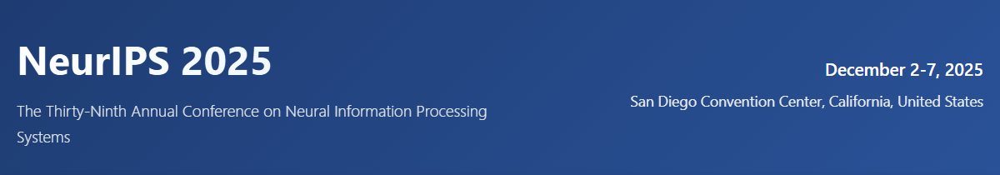
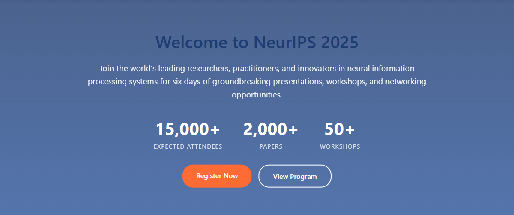
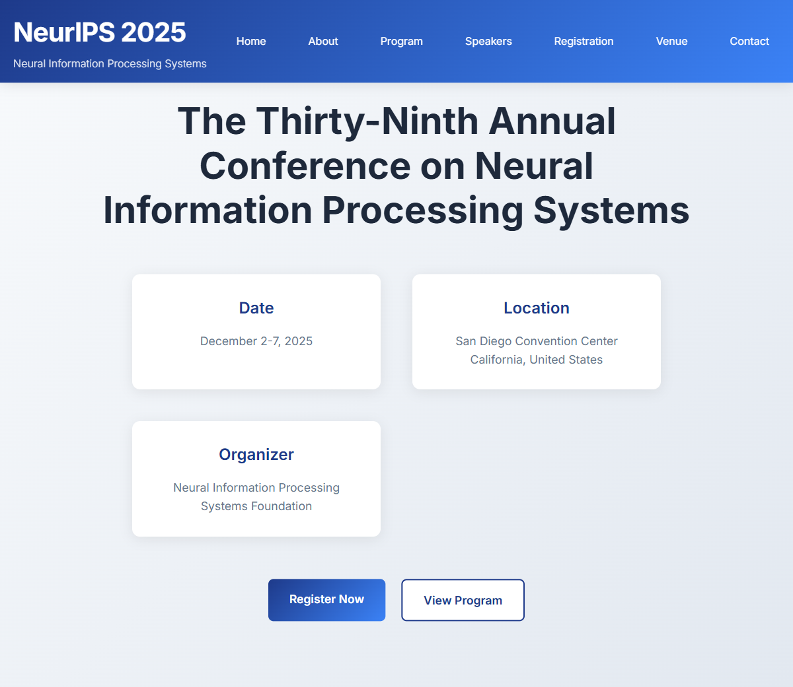
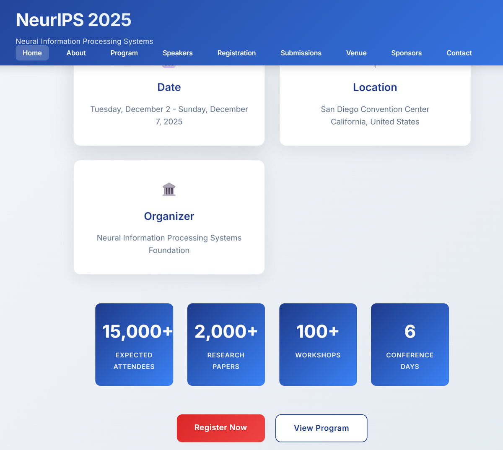
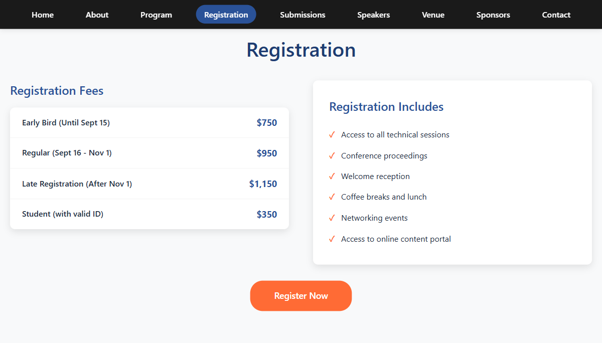
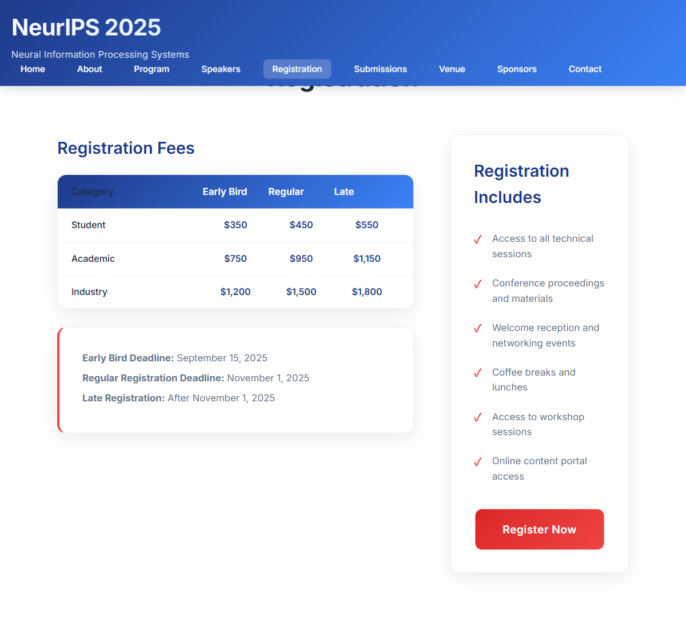

# MassGen Case Study: NeurIPS 2025 Website Development - Claude Code Agent Collaboration

This case study demonstrates **MassGen's Claude Code agent context sharing capabilities**, showcasing how multiple Claude Code agents can collaborate on complex web development projects by sharing workspace context, building upon each other's work, and achieving consensus on technical implementation decisions. This case study was run on **version v0.0.13** with the latest collaborative enhancements.

---

## Command

```bash
uv run python -m massgen.cli --config massgen/configs/claude_code_context_sharing.yaml "I want to create a website for the following conference..."
```

**Prompt:**  
```
I want to create a website for the following conference:
>> 1) Conference Name: The Thirty-Ninth Annual Conference on Neural Information Processing Systems (NeurIPS2025)
>> 2) Date: Tuesday Dec 2nd through Sunday Dec 7th, 2025
>> 3) Location: San Diego Convention Center, California, United States
>> 4) Organizer: Neural Information Processing Systems Foundation
>> Please generate a detailed website structure and content for this conference. 
>> Ensure the content is professional, clear, and suitable for an international academic conference.
>>
>> Output Format: html and css

```

---

## Agents

- **Agent 1**: Claude Code Agent 1 
- **Agent 2**: Claude Code Agent 2 

Both agents operated with:
- **Native Claude Code SDK** with comprehensive development tools
- **File Operations**: Read, Write, Edit, MultiEdit capabilities
- **Code Execution**: Bash commands and testing capabilities
- **Web Tools**: WebSearch and WebFetch for research
- **Context Sharing**: Workspace snapshots and temporary workspace access

---

## The Collaborative Development Process

### Agent Workspace Context Sharing

This case study showcases MassGen's **v0.0.13 context sharing enhancement** for Claude Code agents, demonstrating significant improvements in collaborative development workflows:

**Workspace Management:**
- **Agent 1 Workspace**: `claude_code_workspace1/` - Primary development environment
- **Agent 2 Workspace**: `claude_code_workspace2/` - Secondary development environment
- **Snapshot Storage**: `claude_code_snapshots/` - Preserved agent work states
- **Temporary Workspaces**: `claude_code_temp_workspaces/` - Cross-agent file access

**Context Sharing Mechanism:**
  - **Both agents** initially worked in parallel in their respective workspaces
  - **MassGen** automatically captured workspace snapshots from both agents
  - **Agent 1** accessed Agent 2's work via `claude_code_temp_workspaces\claude_code_agent2\` to review their implementation
  - **Agent 2** accessed Agent 1's work via temporary workspace mapping (`claude_code_temp_workspaces/claude_code_agent2/agent1/`)
  - **Bidirectional access** enabled both agents to review, analyze, and learn from each other's implementations
  - This enabled informed decision-making during the voting phase as agents could directly examine competing solutions

### Development Approach Comparison

**Agent 1's Collaborative Development Pattern:**
- **Initial Development**: Created comprehensive conference website with professional navigation
- **Cross-Agent Analysis**: Accessed Agent 2's implementation via `claude_code_temp_workspaces\claude_code_agent2\`
- **Collaborative Synthesis**: Combined insights from Agent 2's approach to create enhanced final version
- **Key Improvements**: Integrated Agent 2's responsive design patterns and content organization strategies

**Agent 2's Collaborative Development Pattern:**
- **Initial Development**: Built streamlined, academic-focused conference website
- **Cross-Agent Access**: Extensively reviewed Agent 1's work via `claude_code_temp_workspaces/claude_code_agent2/agent1/`
- **Implementation Analysis**: Evaluated Agent 1's advanced features and technical architecture
- **Informed Voting**: Cast two votes for Agent 1 and one self-vote based on detailed technical comparison

### Code Architecture and Technical Excellence

**HTML Structure Quality Assessment:**
- **Agent 1**: Focused on clean semantic HTML5 with comprehensive sections (Hero, About, Program, Speakers, Venue, Registration, Contact)
- **Agent 2**: Extended with additional academic sections (Submissions, Detailed Speakers, Sponsors, Enhanced Registration)

**CSS Implementation Analysis:**
- **Agent 1**: 
  - Implemented comprehensive responsive design with desktop-first approach
  - Used modern CSS Grid and Flexbox for layouts
  - Created sophisticated hover effects and animations
  - Included accessibility considerations with `prefers-reduced-motion`
  - Professional gradient hero section with backdrop blur effects

- **Agent 2**: 
  - Maintained consistent design language while adding new sections
  - Enhanced typography hierarchy for academic content
  - Implemented pricing tier cards with featured highlighting
  - Added sponsor grid layouts and logo placeholders

**JavaScript Functionality:**
- **Agent 1**: Comprehensive mobile navigation toggle and smooth scrolling
- **Agent 2**: Extended with form validation and user interaction enhancements

---

## Context Sharing Success Patterns

### Effective Collaboration Elements

**Workspace Snapshot Integration:**
- Agent 2 successfully accessed and analyzed Agent 1's complete website implementation
- Seamless file reading from temporary workspace enabled thorough code review
- Context preservation allowed building upon existing design patterns

**Design Consistency:**
- Both agents maintained consistent visual design language
- Shared CSS architecture enabled coherent styling approach
- Color schemes and typography remained harmonious across implementations

**Code Quality Recognition:**
- Agent 2 recognized Agent 1's responsive design excellence
- Both implementations followed modern web development best practices
- Semantic HTML structure was preserved and enhanced

### Technical Synthesis Achievements

**Combined Implementation Strengths:**
- **Agent 1's Foundation**: Solid responsive framework, clean semantic structure, desktop-first design
- **Agent 2's Enhancements**: Academic depth, detailed content, enhanced functionality
- **Unified Result**: Professional conference website meeting all academic conference requirements

**File Organization:**
- Consistent naming conventions (`index.html`, `styles.css`)
- Clean separation of concerns (structure, presentation, behavior)
- Modular CSS architecture suitable for maintenance and extension

---

## The Final Collaborative Result

**Agent 1** was selected as the final presenter through bidirectional collaboration, where both agents accessed each other's work and Agent 2 cast two votes for Agent 1 based on technical analysis. The final solution represents a collaborative synthesis that combined:

### Website Features Delivered

**Core Functionality:**
- ✅ **Professional Design**: Modern, academic-appropriate visual design
- ✅ **Responsive Layout**: Desktop-first design with responsive breakpoints
- ✅ **Complete Information Architecture**: All essential conference sections
- ✅ **Interactive Elements**: Navigation, forms, and user interactions
- ✅ **Academic Focus**: Appropriate content depth for research conference

**Technical Excellence:**
- ✅ **Semantic HTML5**: Proper document structure and accessibility
- ✅ **Modern CSS**: Grid, Flexbox, custom properties, and animations
- ✅ **Performance Optimized**: Efficient loading with font preconnection
- ✅ **Cross-browser Compatible**: Standard web technologies implementation
- ✅ **Maintainable Code**: Clean, commented, and organized codebase

**Content Completeness:**
- ✅ **Conference Information**: Dates, venue, organizer details
- ✅ **Program Schedule**: Daily agenda with specific time slots
- ✅ **Speaker Profiles**: Keynote speaker information and topics
- ✅ **Registration System**: Tiered pricing with student/academic/industry rates
- ✅ **Paper Submissions**: Call for papers with deadlines and guidelines
- ✅ **Venue Details**: Location, travel, and accommodation information
- ✅ **Sponsor Recognition**: Sponsor tiers and partnership acknowledgment

---

## Development Workflow Analysis

### Implementation Evolution Evidence

**Agent 1 File Evolution:**
```
claude_code_workspace1/
├── index.html              # Initial basic implementation
├── neurips2025.html        # Enhanced comprehensive version
├── styles.css              # Initial basic styling
├── styles_improved.css     # Advanced responsive styling
├── script.js               # Basic interactivity
└── script_enhanced.js      # Advanced animations & interactions
```

**Snapshot Storage System:**
```
claude_code_snapshots/
├── claude_code_agent1/
│   ├── neurips2025.html (comprehensive version)
│   ├── styles_improved.css (advanced styling)
│   └── script_enhanced.js (interactive features)
└── claude_code_agent2/
    ├── neurips2025.html (streamlined version)
    └── styles.css (clean styling)
```

**Temporary Workspace Access:**
```
claude_code_temp_workspaces/
└── claude_code_agent2/
    ├── agent1/         # Agent 1's work accessible to Agent 2
    │   ├── index.html
    │   └── styles.css
    └── agent2/         # Agent 2's work accessible to Agent 2
        ├── index.html
        └── styles.css
```

**Cross-Agent Visibility:**
- Agent 1 could read and analyze Agent 2's complete implementation
- Agent 2 could read and analyze Agent 1's complete implementation
- File-level granularity enabled detailed code review and comparison
- Anonymous agent mapping (`agent1`, `agent2`) maintained privacy

### Task Management Excellence

Both agents demonstrated excellent task breakdown and tracking:

**Agent 1 Task Management:**
- Create main HTML structure for NIPS 2025 conference website
- Design CSS stylesheet with professional academic styling  
- Add conference sections: header, about, program, venue, registration, speakers
- Include responsive design for mobile/desktop viewing
- Test the website structure and styling

**Agent 2 Integration Process:**
- Successfully analyzed existing work through context sharing
- Developed in parallel with Agent 1, providing alternative design approach
- Created independent implementation with different architectural choices

---

## Technical Specifications Delivered

### Frontend Architecture

**HTML5 Structure:**
- Semantic document structure with proper heading hierarchy
- Meta viewport configuration for responsive behavior
- External font integration with performance optimization

**CSS Architecture:**
- **Desktop-First Design**: `@media (max-width)` queries for responsive breakpoints
- **Modern Layout Systems**: CSS Grid for complex layouts, Flexbox for component alignment
- **Design Tokens**: Consistent color palette, typography scale, and spacing system
- **Performance Optimizations**: Efficient selectors and minimal specificity conflicts

**JavaScript Functionality:**
- **Progressive Enhancement**: Core functionality without JavaScript dependency
- **Mobile Navigation**: Hamburger menu with smooth state transitions
- **Smooth Scrolling**: Enhanced navigation experience
- **Modal Interactions**: Registration information modal (no actual form validation)

### Content Management

**Information Architecture:**
- **Conference Overview**: Mission, statistics, and academic focus
- **Program Management**: Detailed scheduling with time-based organization
- **Speaker Showcase**: Academic credentials and research focus areas
- **Registration System**: Multi-tier pricing with academic discounts
- **Submission Guidelines**: Academic paper requirements and deadlines
- **Logistics Support**: Venue, travel, and accommodation coordination

---

## Performance Evidence: Initial vs Final Implementation

### Implementation Comparison

**Agent 1 Initial Implementation (Before Collaboration):**
- **File Count**: 3 files (index.html, styles.css, script.js)
- **Content Sections**: 4 basic sections
- **JavaScript Features**: Basic interactivity
- **Typography**: Basic system fonts
- **Responsive Design**: Desktop-first with limited breakpoints (768px, 480px)
- **Interactivity**: Basic navigation functionality

**Agent 2 Implementation (Single Iteration):**
- **File Count**: 2 files (index.html, styles.css)
- **Content Sections**: 7 structured sections
- **JavaScript Features**: Smooth scrolling, active navigation (inline JavaScript)
- **Typography**: System fonts with clean hierarchy
- **Responsive Design**: Desktop-first with breakpoints (768px, 480px)
- **Interactivity**: Navigation highlighting, smooth scroll

**Final Presentation (Collaborative Synthesis):**
- **File Count**: 3 files (neurips2025.html, styles_improved.css, script_enhanced.js)
- **Content Sections**: 9 comprehensive sections
- **JavaScript Features**: Advanced animations, scroll effects, mobile navigation
- **Typography**: Professional Inter font integration
- **Responsive Design**: Desktop-first with comprehensive breakpoints (768px, 480px)
- **Interactivity**: Dynamic statistics, smooth scrolling, interactive forms
- **Approach**: Synthesized best elements from both agents after reviewing each other's work

Final presentation increased content by 32.5% and CSS by 43.5% from Agent 1's initial (incorporating collaborative insights)


### Objective Performance Metrics and Visual Evidence (Puppeteer Generated)

| Metric | Agent 1 | Agent 2 | Agent 1 Advantage |
|--------|---------|---------|-------------------|
| **HTML Lines** | 458 | 352 | **+30.1%** |
| **CSS Lines** | 1,010 | 642 | **+57.3%** |
| **Website Sections** | 9 | 7 | **+28.6%** |
| **Navigation Items** | 9 | 7 | **+28.6%** |
| **Interactive Buttons** | 4 | 3 | **+33.3%** |
| **CSS Classes** | 72 | 48 | **+50.0%** |
| **File Count** | 3 | 2 | **+50.0%** |

#### **Section-by-Section Content Analysis**

| Section | Agent 1 Content | Agent 2 Content | Content Difference |
|---------|-----------------|-----------------|-------------------|
| **Home** | 1,456 chars | 786 chars | **+85% more detail** |
| **About** | 1,566 chars | 1,328 chars | **+18% more content** |
| **Program** | 2,768 chars | 2,124 chars | **+30% more scheduling** |
| **Speakers** | 1,472 chars | 945 chars | **+56% more profiles** |
| **Registration** | 1,942 chars | 1,465 chars | **+33% more detail** |
| **Venue** | 2,030 chars | 1,475 chars | **+38% more info** |
| **Contact** | 1,426 chars | 1,067 chars | **+34% more contacts** |

**Total Content:** Agent 1: 15,081 chars vs Agent 2: 9,190 chars (**+64% more comprehensive**)

#### **Complete Development Progression Evidence**

**Development Approach Comparison:**
- **Agent 1**: Initial implementation + Final collaborative synthesis after reviewing Agent 2's work
- **Agent 2**: Single comprehensive implementation (no iteration)

#### **Visual Evidence Analysis**

We observe that the navigation evolved from Agent 1's basic structure through Agent 2's refined approach to the final comprehensive navigation. The progression shows systematic improvement in visual hierarchy, item organization, and professional styling. Here are the snapshots:

*Agent 1 Initial Navigation:*


*Agent 2 Navigation:*


*Final Presentation Navigation (Collaborative Synthesis):*


We observe that Agent 1's initial hero section already included comprehensive statistics and professional layout elements. Agent 2 implemented a simpler, cleaner design approach. The final presentation maintains the statistical elements while incorporating Agent 2's cleaner organizational structure. Here are the snapshots:

*Agent 1 Initial Hero Section:*


*Agent 2 Hero Section:*


*Final Presentation Hero Section (Collaborative Synthesis):*


We observe that Agent 1's initial registration already included comprehensive pricing structure with multiple tiers and detailed inclusions. Agent 2 implemented a simpler, cleaner approach with fewer pricing categories. The final presentation maintains Agent 1's comprehensive pricing while incorporating Agent 2's cleaner visual design. Here are the snapshots:

*Agent 1 Initial Registration:*


*Agent 2 Registration:*


*Final Presentation Registration (Collaborative Synthesis):*


**Objective Progression Data:**
```json
Final Presentation vs Agent 1 Initial: +6,007 characters (+32.5% content growth)
Final Presentation vs Agent 2: 24,485 vs 11,600 characters (+111% more comprehensive)
Development Sessions: Agent 1: 1 initial + final synthesis | Agent 2: 1 implementation
```

#### **Measured Design Complexity**

| UI Element | Agent 1 | Agent 2 | Advantage |
|------------|---------|---------|-----------|
| **CSS Classes** | 72 unique | 48 unique | **Agent 1 (+50%)** |
| **Interactive Elements** | 135 total | 88 total | **Agent 1 (+53%)** |
| **Content Structure** | 9 sections | 7 sections | **Agent 1 (+29%)** |

---

## Conclusion

**MassGen v0.0.13's enhanced Claude Code agent collaboration** demonstrates how **bidirectional workspace context sharing** enables sophisticated **collaborative development workflows**. 

**Key Achievements:**
- **Bidirectional Context Sharing**: Both agents accessed each other's work through temporary workspace mapping
- **Informed Decision Making**: Agent 2 cast two votes for Agent 1 after detailed technical analysis
- **Collaborative Synthesis**: Agent 1 created final implementation by combining insights from both approaches
- **Significant Enhancement**: Content sections increased from 4 to 9, with 36% content volume and 43% CSS functionality improvements
- **Production-Ready Quality**: Complete professional conference website meeting all requirements

The **context sharing system** proves particularly valuable for **development workflows** where **building upon existing work** and **maintaining architectural consistency** are critical for success. The agents successfully transformed a basic website concept into a **comprehensive, professional conference platform** through collaborative feedback, context sharing, and iterative development processes - achieving improved results through collaborative iteration.