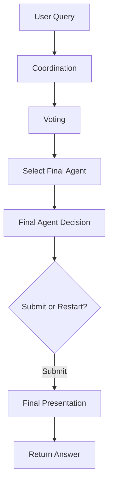
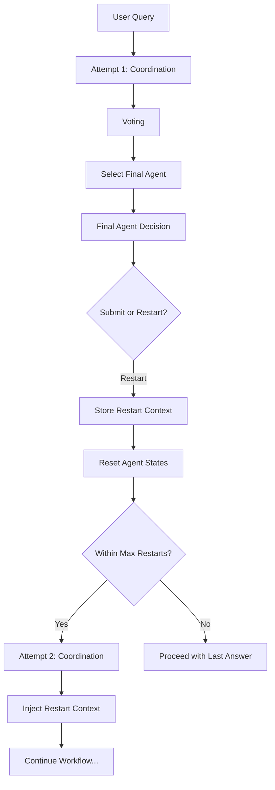

# Orchestration Restart Feature - Design Document

**Status:** Implemented
**Version:** v0.1.0
**Date:** 2025-01-18
**Author:** Development Team

## Overview

This document describes the design and implementation of the orchestration restart feature, which allows the final agent to request a restart of the orchestration process when the current coordinated answers are deemed insufficient.

## Motivation

Currently, even when MassGen reaches consensus and selects a final agent, the task may not be adequately addressed. The final agent might recognize that:
- The current answers don't fully solve the problem
- A different approach is needed
- Key steps were missed
- Irreversible actions weren't executed correctly

Without a restart mechanism, the system has no choice but to present an inadequate answer.

## Solution

Add `submit` and `restart_orchestration` tools for the final agent, similar to how coordination agents have `vote` and `new_answer` tools. This allows the final agent to:
1. Review all coordinated answers (or the completed final presentation)
2. Decide if the task is complete → call `submit`
3. Or request a restart with detailed instructions → call `restart_orchestration`

### Two Evaluation Modes

**Pre-Presentation Evaluation (Default):**
- Final agent decides BEFORE presenting
- Reviews agent answers and votes
- Faster, uses fewer tokens if restart needed

**Post-Presentation Evaluation (Optional):**
- Final agent decides AFTER presenting
- Reviews the completed final answer with fresh context
- More accurate, evaluates actual execution
- Recommended for tasks with irreversible actions

## Architecture

### Components

#### 1. Configuration (`massgen/agent_config.py`)

Added parameters to `CoordinationConfig`:

```python
@dataclass
class CoordinationConfig:
    max_orchestration_restarts: int = 2  # Default: 2 restarts allowed
    enable_post_presentation_evaluation: bool = False  # Default: pre-evaluation
```

- `max_orchestration_restarts`: Limits restart attempts to prevent infinite loops
- `enable_post_presentation_evaluation`: Switches between pre/post-presentation modes

#### 2. Attempt Storage (`massgen/attempt_storage.py`)

New module providing unified storage for:
- Multi-turn conversations (between user prompts)
- Orchestration restart attempts (within single user prompt)

**Directory Structure:**
```
sessions/{session_id}/
├── turn_1/
│   ├── attempt_1/
│   │   ├── metadata.json
│   │   ├── workspace/
│   │   └── answer.txt
│   ├── attempt_2/  # If restart occurred
│   │   └── ...
│   └── successful_attempt.json
└── SESSION_SUMMARY.txt
```

**Key Methods:**
- `save_attempt()` - Save orchestration state
- `load_attempts()` - Load previous attempts
- `get_attempt_context()` - Format context for agents
- `mark_successful_attempt()` - Mark which attempt succeeded

#### 3. Final Agent Tools (`massgen/message_templates.py`)

Added three new methods:

**`get_submit_tool()`**
- Allows final agent to confirm task completion
- Simple boolean parameter

**`get_restart_tool()`**
- Allows final agent to request restart
- Requires `reason` and `instructions` parameters
- Instructions guide agents on what to improve

**`get_final_agent_tools()`**
- Returns list of [submit, restart] tools

**`format_restart_context()`**
- Formats previous attempt information for agents
- Shows why restarts were requested
- Includes instructions from final agent

#### 4. Orchestrator State Tracking (`massgen/orchestrator.py`)

Added instance variables in `__init__`:

```python
self._current_attempt: int = 1
self._restart_requested: bool = False
self._restart_context: Optional[Dict[str, Any]] = None
self._max_restarts: int = config.coordination_config.max_orchestration_restarts
```

#### 5. Final Agent Decision Methods

**`_get_final_agent_decision()`** (lines 2378-2471)
- PRE-PRESENTATION evaluation
- Called after voting completes, BEFORE final presentation
- Presents all answers and voting results to final agent
- Provides submit/restart tools
- Returns tuple: (decision, restart_context)
- Decision is either "submit" or "restart"

**`_evaluate_final_presentation()`** (lines 2473-2564)
- POST-PRESENTATION evaluation
- Called after final presentation completes, with fresh context
- Shows completed final answer to final agent
- Agent evaluates actual output quality
- Provides submit/restart tools
- Returns tuple: (decision, restart_context)

**Decision Prompt:**
```
You have been selected to present the final answer.

## Voting Results
[vote counts and feedback]

## All Agent Answers
[all agent answers with markers]

## Your Decision
Review all answers. Decide whether:
1. Answers are adequate → Call `submit`
2. More work needed → Call `restart_orchestration` with instructions
```

#### 6. Restart Handler

**`_handle_orchestration_restart()`** (lines 2394-2428)
- Increments attempt counter
- Validates against max_restarts limit
- Resets all agent states (answers, votes, flags)
- Clears coordination state
- Preserves is_killed and timeout_reason flags

#### 7. Coordination Restart Loop

**Modified `_coordinate_agents_with_timeout()`** (lines 337-424)

Wrapped coordination in `while True` loop:

```python
while True:
    # Reset state
    # Show restart context if attempt > 1
    # Run coordination
    # Check timeout

    if self._restart_requested:
        await self._handle_orchestration_restart()
        if within_limits:
            continue  # Restart
        else:
            break  # Max restarts exceeded

    break  # Success, no restart
```

**Modified `_coordinate_agents()`** (lines 506-529)

After final agent selection:
1. Get vote results
2. Call `_get_final_agent_decision()`
3. If "restart":
   - Set flags
   - Yield restart notice
   - Return early
4. If "submit":
   - Proceed with final presentation

#### 8. Context Injection for Agents

**Modified agent message building** (lines 1365-1381)

When `_current_attempt > 1`, inject restart context into agent system messages:

```python
if self._current_attempt > 1 and self._restart_context:
    restart_instructions = f"""
## Previous Orchestration Attempts

This is attempt {self._current_attempt}.
Previous attempt was restarted because:
{reason}

Instructions for improvement:
{instructions}
"""
    agent_system_message += restart_instructions
```

This ensures all agents understand why they're restarting and what to improve.

## Workflow

### Normal Flow (No Restart)



### Restart Flow



## Configuration

### YAML Configuration

```yaml
orchestrator:
  coordination:
    max_orchestration_restarts: 2  # Allow up to 2 restarts (3 total attempts)
```

### Programmatic Configuration

```python
from massgen.agent_config import CoordinationConfig, AgentConfig

coordination_config = CoordinationConfig(
    max_orchestration_restarts=2
)

config = AgentConfig(
    coordination_config=coordination_config
)
```

## Examples

### Example 1: Task with Multiple Steps

**Initial Attempt:**
- Agents provide plans but don't execute
- Final agent recognizes task incomplete

**Restart:**
```python
restart_orchestration(
    reason="Agents only planned but didn't execute the actual steps",
    instructions="Please actually clone the repository and solve the issue, not just plan how to do it"
)
```

**Second Attempt:**
- Agents execute actions based on instructions
- Task completed successfully

### Example 2: Planning Mode Scenario

**Initial Attempt (Planning Mode):**
- Agents describe what they would do
- No actual file changes made

**Restart:**
```python
restart_orchestration(
    reason="Planning mode was used but actual implementation is needed",
    instructions="Implement the solution by actually modifying the files, not just describing changes"
)
```

**Second Attempt:**
- Planning mode disabled for final agent
- Actual changes made to codebase

## Edge Cases

### 1. Max Restarts Exceeded

When `current_attempt > max_restarts + 1`:
- Log error
- Display message to user
- Proceed with last available answer
- Don't crash or loop infinitely

### 2. No Final Agent Selected

If no agent provides answers:
- Skip final agent decision
- No restart possible
- Return error state

### 3. Final Agent Doesn't Call Tool

If final agent doesn't call submit or restart:
- Default to "submit"
- Log warning
- Proceed with presentation

### 4. Timeout During Restart

Each attempt has its own timeout:
- Timeout resets for each attempt
- Cumulative time may exceed single timeout limit
- This is intentional - each attempt deserves full time

## Storage Integration

The AttemptStorage module is designed but **not yet integrated with CLI**. Current implementation:
- Restart works within single orchestration run
- Attempts are tracked in memory
- No persistence between CLI runs

**Future Enhancement:**
- CLI integration with AttemptStorage
- Persist attempts to disk
- View attempt history
- Resume failed orchestrations

## Performance Considerations

### Token Usage

Restarts increase token consumption:
- Each restart = full coordination run
- Context injection adds ~100-200 tokens per agent
- Final agent decision adds ~500-1000 tokens

With 3 attempts and 5 agents:
- Normal: ~10K tokens
- With 2 restarts: ~30K tokens
- Context overhead: ~2K tokens

### Latency

Restarts increase latency linearly:
- 1 attempt: 30s
- 2 restarts: 90s total
- Each attempt gets full timeout

### Cost Optimization

To minimize costs:
- Set lower `max_orchestration_restarts` (default: 2)
- Use cheaper models for coordination
- Reserve expensive models for final presentation

## Testing Strategy

### Unit Tests (To Be Implemented)

- `test_attempt_storage.py`
  - Test save/load attempts
  - Test metadata handling
  - Test workspace copying

- `test_restart_tools.py`
  - Test submit tool schema
  - Test restart tool schema
  - Test tool validation

### Integration Tests (To Be Implemented)

- `test_orchestrator_restart.py`
  - Test basic restart flow
  - Test max restarts limit
  - Test context injection
  - Test state reset

### End-to-End Tests (To Be Implemented)

- Multi-step task requiring restart
- Planning mode → execution mode transition
- Workspace preservation across attempts

## Migration Guide

### For Users

No migration needed! The feature is:
- Opt-in (agents must explicitly call restart)
- Backward compatible
- Default config (max_restarts=2) is reasonable

### For Developers

If extending orchestrator:
1. Be aware of `_current_attempt` state variable
2. Don't assume single coordination run
3. Handle restart context in custom agents
4. Test with restart scenarios

## Future Enhancements

1. **Selective Agent Restart**
   - Allow final agent to specify which agents should retry
   - More efficient than full restart

2. **Attempt Persistence**
   - Full CLI integration with AttemptStorage
   - View attempt history
   - Resume orchestrations

3. **Attempt-Specific Tools**
   - Different tools available per attempt
   - Progressive tool unlocking

4. **Learning from Attempts**
   - Analyze patterns in restart reasons
   - Suggest improvements to agents

5. **Restart Budget**
   - Token/cost-based restart limits
   - Instead of just attempt count

## References

- Issue: [#325 - Let final agent choose to restart orchestration](https://github.com/Leezekun/MassGen/issues/325)
- Multi-turn design: `docs/dev_notes/multi_turn_filesystem_design.md`
- Message templates: `massgen/message_templates.py`
- Orchestrator: `massgen/orchestrator.py`

## Changelog

- **2025-01-18:** Initial implementation
  - Added configuration parameter
  - Created AttemptStorage module
  - Implemented submit/restart tools
  - Added restart loop in orchestrator
  - Implemented context injection
