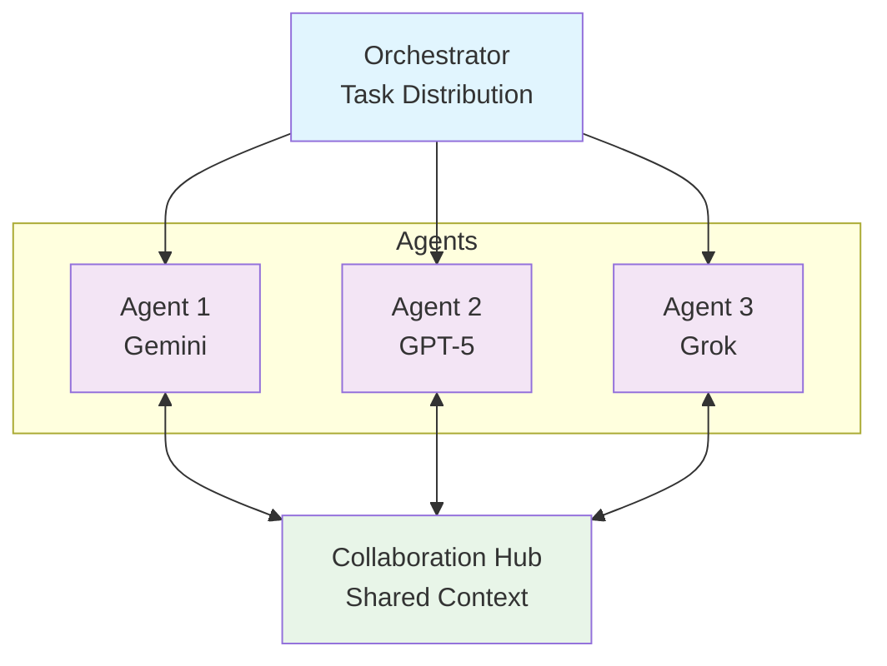

# Multi-Agent Coordination

**Core Feature:** Available since v0.0.3 (August 2025)
**Enhanced in:** v0.0.8 (Timeout Management), v0.0.19 (Coordination Tracking), v0.0.29 (Planning Mode)

MassGen's core strength lies in its multi-agent coordination system, where multiple AI agents work together to solve complex tasks through parallel processing, intelligence sharing, and consensus building. This guide explains how agents collaborate and how to configure multi-agent systems.

## How Multi-Agent Collaboration Works

MassGen orchestrates multiple agents through a sophisticated coordination system:



### Core Principles

**1. Parallel Processing**
Multiple agents work simultaneously on the same task, each bringing unique capabilities and perspectives.

**2. Real-Time Collaboration**
Agents continuously share their work-in-progress and insights through a notification system.

**3. Intelligence Sharing**
Agents observe each other's approaches and learn from collective knowledge.

**4. Consensus Building**
Natural convergence through collaborative refinement rather than forced agreement.

**5. Adaptive Coordination**
Agents can restart and refine their work when they receive new insights from others.

## Basic Multi-Agent Configuration

### Two Agents

Simple collaboration between two agents:

```yaml
agents:
  - id: "gemini-2.5-pro1"
    backend:
      type: "gemini"
      model: "gemini-2.5-pro"
      enable_web_search: true

  - id: "gemini-2.5-pro2"
    backend:
      type: "gemini"
      model: "gemini-2.5-pro"
      enable_web_search: true

ui:
  display_type: "rich_terminal"
  logging_enabled: true
```

**Usage:**
```bash
massgen --config @examples/basic_multi_two_agents_gemini \
  "Research the best practices for Python async programming"
```

**Example Configs:**
- [`two_agents_gemini.yaml`](../../massgen/configs/basic/multi/two_agents_gemini.yaml) - Dual Gemini agents
- [`two_agents_gpt5.yaml`](../../massgen/configs/basic/multi/two_agents_gpt5.yaml) - Dual GPT-5 agents

### Three Agents (Recommended)

Balanced collaboration with diverse perspectives:

```yaml
agents:
  - id: "gemini2.5flash"
    backend:
      type: "gemini"
      model: "gemini-2.5-flash"
      enable_web_search: true

  - id: "gpt5nano"
    backend:
      type: "openai"
      model: "gpt-5-nano"
      text:
        verbosity: "medium"
      reasoning:
        effort: "medium"
      enable_web_search: true
      enable_code_interpreter: true

  - id: "grok3mini"
    backend:
      type: "grok"
      model: "grok-3-mini"
      enable_web_search: true

ui:
  display_type: "rich_terminal"
  logging_enabled: true
```

**Usage:**
```bash
massgen --config @examples/basic_multi_three_agents_default \
  "Analyze the pros and cons of renewable energy"
```

**Why Three Agents?**
- **Diversity**: Different models bring different strengths
- **Tie-breaking**: Odd number prevents deadlocks in voting
- **Efficiency**: Good balance between perspectives and speed

**Example Config:** [`three_agents_default.yaml`](../../massgen/configs/basic/multi/three_agents_default.yaml)

### Five Agents

Maximum diversity and robustness:

```yaml
agents:
  - id: "gemini_agent"
    backend:
      type: "gemini"
      model: "gemini-2.5-flash"

  - id: "openai_agent"
    backend:
      type: "openai"
      model: "gpt-4o-mini"

  - id: "claude_code_agent"
    backend:
      type: "claude_code"
      cwd: "workspace"

  - id: "claude_agent"
    backend:
      type: "claude"
      model: "claude-sonnet-4-20250514"

  - id: "grok_agent"
    backend:
      type: "grok"
      model: "grok-3-mini"
```

**Usage:**
```bash
massgen --config @examples/tools_planning_five_agents_discord_mcp_planning_mode \
  "Check recent Discord messages and post a summary"
```

**When to Use Five Agents:**
- Complex tasks requiring multiple perspectives
- Critical decisions needing robust consensus
- Tasks benefiting from diverse model strengths

**Example Configs:**
- [`five_agents_discord_mcp_planning_mode.yaml`](../../massgen/configs/tools/planning/five_agents_discord_mcp_planning_mode.yaml)
- [`five_agents_filesystem_mcp_planning_mode.yaml`](../../massgen/configs/tools/planning/five_agents_filesystem_mcp_planning_mode.yaml)
- [`five_agents_weather_mcp_test.yaml`](../../massgen/configs/tools/mcp/five_agents_weather_mcp_test.yaml)

## Coordination Workflow

### Phase 1: Initial Answering

1. **Task Distribution**: Orchestrator assigns the same task to all agents
2. **Parallel Execution**: Agents work simultaneously on the task
3. **Individual Answers**: Each agent generates their initial response

**What Happens:**
- All agents receive identical task
- Agents work independently (no coordination yet)
- Each agent's unique capabilities inform their approach

### Phase 2: Coordination Rounds

Agents share insights and refine approaches through coordination rounds:

```
Round 1:
├── Agents observe each other's initial answers
├── Each agent evaluates other approaches
├── Agents vote or propose improved answers
└── System checks for convergence

Round 2 (if needed):
├── Agents see refined proposals
├── Further evaluation and voting
├── Convergence detection continues
└── Process repeats until consensus
```

**Coordination Actions:**

| Action | When Used | Effect |
|--------|-----------|--------|
| `vote` | Agent supports existing answer | Vote for best approach |
| `new_answer` | Agent proposes improvement | Restart coordination with new proposal |
| `final_presentation` | Consensus reached | Selected agent presents final answer |

### Phase 3: Convergence & Final Presentation

**Convergence Detected When:**
- Majority of agents vote for the same answer
- No new proposals emerge for multiple rounds
- System detects stable consensus

**Final Presentation:**
1. Winning agent (most votes) is selected
2. Agent presents comprehensive final answer
3. For filesystem/MCP tasks: Agent executes planned actions
4. Results are displayed and logged

## Voting and Consensus

### How Voting Works

Agents vote for the best answer they've seen:

```python
# Agent evaluation process
1. Agent reads all proposals
2. Agent compares approaches
3. Agent votes for best answer (can vote for own answer)
4. Orchestrator tallies votes

# Voting example:
Agent 1 → votes for Agent 3's answer
Agent 2 → votes for Agent 3's answer
Agent 3 → votes for own answer
Result: Agent 3 wins (3 votes)
```

### Consensus Building

**Natural Convergence:**
- Agents genuinely evaluate quality
- No forced agreement
- Best ideas naturally gain support
- Agents can change votes in subsequent rounds

**Benefits:**
- **Quality**: Best answer emerges naturally
- **Robustness**: Multiple perspectives validate solution
- **Adaptability**: Agents learn from each other

## Model Mixing Strategies

Combine different models for optimal results:

### Research & Analysis Team

```yaml
agents:
  - id: "gemini_researcher"
    backend:
      type: "gemini"
      model: "gemini-2.5-pro"
      enable_web_search: true  # Fast web research

  - id: "gpt5_analyst"
    backend:
      type: "openai"
      model: "gpt-5"
      reasoning:
        effort: "high"  # Deep reasoning

  - id: "grok_validator"
    backend:
      type: "grok"
      model: "grok-4"
      enable_web_search: true  # Real-time validation
```

**Strengths:**
- Gemini: Fast research with web search
- GPT-5: Deep reasoning and analysis
- Grok: Real-time information validation

**Example Config:** [`gemini_4o_claude.yaml`](../../massgen/configs/basic/multi/gemini_4o_claude.yaml)

### Development Team

```yaml
agents:
  - id: "architect"
    backend:
      type: "gemini"
      model: "gemini-2.5-pro"

  - id: "implementer"
    backend:
      type: "claude_code"
      cwd: "implementation_workspace"

  - id: "reviewer"
    backend:
      type: "openai"
      model: "gpt-5-nano"
      enable_code_interpreter: true
```

**Strengths:**
- Gemini: System design and architecture
- Claude Code: Code implementation
- GPT-5: Code review and testing

### Creative Writing Team

```yaml
agents:
  - id: "storyteller"
    backend:
      type: "claude"
      model: "claude-sonnet-4-20250514"

  - id: "editor"
    backend:
      type: "gemini"
      model: "gemini-2.5-flash"

  - id: "critic"
    backend:
      type: "openai"
      model: "gpt-5-nano"
```

**Strengths:**
- Claude: Creative storytelling
- Gemini: Structural editing
- GPT-5: Critical feedback

**Example Config:** [`creative_team.yaml`](../../massgen/configs/teams/creative/creative_team.yaml)

## When to Use Multiple Agents

### ✅ Use Multi-Agent When:

**Complex Tasks**
- Requires multiple perspectives
- Benefits from diverse expertise
- No single "correct" answer

**Critical Decisions**
- Important outcomes
- Need robust validation
- Want multiple viewpoints

**Creative Work**
- Brainstorming and ideation
- Collaborative refinement
- Combining different styles

**Research & Analysis**
- Comprehensive investigation
- Cross-validation of sources
- Balanced perspectives

### ❌ Use Single Agent When:

**Simple Tasks**
- Straightforward questions
- Quick information lookup
- Clear single answer

**Speed Priority**
- Time-sensitive
- Rapid prototyping
- Quick iterations

**Resource Constraints**
- Limited API budget
- Single model sufficient
- Minimal overhead needed

## Agent Count Recommendations

| Agents | Use Case | Pros | Cons |
|--------|----------|------|------|
| **1** | Simple tasks, quick answers | Fast, cheap | No collaboration |
| **2** | Basic collaboration, comparison | Simple, 2 perspectives | Can deadlock |
| **3** | Balanced collaboration | Tie-breaking, efficient | Limited diversity |
| **5** | Complex tasks, critical decisions | Max diversity, robust | Slower, expensive |

## Configuration Patterns

### Homogeneous Teams

Same model, different instances:

```yaml
agents:
  - id: "gemini1"
    backend:
      type: "gemini"
      model: "gemini-2.5-pro"

  - id: "gemini2"
    backend:
      type: "gemini"
      model: "gemini-2.5-pro"

  - id: "gemini3"
    backend:
      type: "gemini"
      model: "gemini-2.5-pro"
```

**Benefits:**
- Consistent reasoning style
- Reduced model-specific biases
- Statistical robustness through repetition

**Use Cases:**
- Need multiple attempts at same task
- Reduce random variation
- Ensemble consensus

### Heterogeneous Teams

Different models, diverse capabilities:

```yaml
agents:
  - id: "gemini"
    backend:
      type: "gemini"
      model: "gemini-2.5-flash"
      enable_web_search: true

  - id: "gpt5"
    backend:
      type: "openai"
      model: "gpt-5"
      reasoning:
        effort: "high"

  - id: "claude"
    backend:
      type: "claude"
      model: "claude-sonnet-4-20250514"
```

**Benefits:**
- Diverse perspectives
- Complementary strengths
- Cross-model validation

**Use Cases:**
- Complex, multi-faceted tasks
- Want different reasoning approaches
- Maximum robustness

### Specialized Roles

Assign specific roles to agents:

```yaml
agents:
  - id: "researcher"
    backend:
      type: "gemini"
      model: "gemini-2.5-pro"
      enable_web_search: true
    system_message: "You are a research specialist. Focus on finding accurate information."

  - id: "analyst"
    backend:
      type: "openai"
      model: "gpt-5"
      reasoning:
        effort: "high"
    system_message: "You are an analytical specialist. Focus on deep reasoning and synthesis."

  - id: "writer"
    backend:
      type: "claude"
      model: "claude-sonnet-4-20250514"
    system_message: "You are a writing specialist. Focus on clear, engaging communication."
```

**Benefits:**
- Clear division of labor
- Leverages specific model strengths
- Organized workflow

**Use Cases:**
- Multi-step tasks
- Distinct task phases
- Complex project work

**Example Config:** [`research_team.yaml`](../../massgen/configs/teams/research/research_team.yaml)

## Advanced Features

### System Messages

Customize each agent's behavior:

```yaml
agents:
  - id: "agent1"
    backend:
      type: "gemini"
      model: "gemini-2.5-flash"
    system_message: |
      You are a helpful AI assistant with web search capabilities.
      For current events, ALWAYS use web search first.
```

**Use Cases:**
- Role-specific instructions
- Task-specific guidance
- Behavioral constraints

### Live Visualization

Watch agents collaborate in real-time:

```yaml
ui:
  display_type: "rich_terminal"  # Live collaboration view
  logging_enabled: true           # Comprehensive logs
```

**Features:**
- Parallel agent status
- Real-time voting updates
- Phase transitions
- Convergence progress

**Disable for automation:**
```yaml
ui:
  display_type: "simple"  # No fancy UI
  logging_enabled: false  # No logs
```

### Interactive Multi-Turn Mode

Continue conversations across multiple rounds:

```bash
# Start interactive mode
uv run python -m massgen.cli \
  --config massgen/configs/basic/multi/three_agents_default.yaml

# Interactive features:
# - Type questions continuously
# - /clear - Reset conversation
# - /quit or Ctrl+C - Exit
# - r - View coordination history
```

**Use Cases:**
- Exploratory analysis
- Iterative refinement
- Back-and-forth discussion

## Troubleshooting

### Agents Not Converging

**Problem:** Coordination continues for many rounds without consensus

**Solutions:**
- Reduce number of agents (try 3 instead of 5)
- Use more similar models (homogeneous team)
- Provide clearer task specifications
- Check if task genuinely has multiple valid approaches

### One Agent Dominates

**Problem:** Same agent wins every round

**Solutions:**
- Review agent capabilities (might be most suitable)
- Check if other agents have necessary tools
- Consider adjusting system messages for diversity
- Ensure all agents have relevant context

### Coordination Too Slow

**Problem:** Multi-agent setup takes too long

**Solutions:**
- Reduce number of agents
- Use faster models (e.g., Flash instead of Pro)
- Simplify the task
- Consider single agent for simple tasks

### Inconsistent Results

**Problem:** Different runs produce very different results

**Solutions:**
- Use more agents for stability (5 instead of 2)
- Set temperature/randomness parameters consistently
- Check for time-sensitive queries (web search)
- Consider if variation is expected (creative tasks)

## All Multi-Agent Configurations

**Browse:** [`massgen/configs/basic/multi/`](../../massgen/configs/basic/multi/)

**By Agent Count:**
- **2 Agents**: [`two_agents_gemini.yaml`](../../massgen/configs/basic/multi/two_agents_gemini.yaml), [`two_agents_gpt5.yaml`](../../massgen/configs/basic/multi/two_agents_gpt5.yaml)
- **3 Agents**: [`three_agents_default.yaml`](../../massgen/configs/basic/multi/three_agents_default.yaml), [`gemini_4o_claude.yaml`](../../massgen/configs/basic/multi/gemini_4o_claude.yaml)
- **5 Agents**: Planning mode configs in [`massgen/configs/tools/planning/`](../../massgen/configs/tools/planning/)

**By Backend Mix:**
- **All Gemini**: [`two_agents_gemini.yaml`](../../massgen/configs/basic/multi/two_agents_gemini.yaml)
- **All GPT**: [`gpt5.yaml`](../../massgen/configs/providers/openai/gpt5.yaml)
- **Mixed**: [`three_agents_default.yaml`](../../massgen/configs/basic/multi/three_agents_default.yaml) (Gemini + GPT + Grok)

**By Use Case:**
- **Research**: [`research_team.yaml`](../../massgen/configs/teams/research/research_team.yaml)
- **Creative**: [`creative_team.yaml`](../../massgen/configs/teams/creative/creative_team.yaml)
- **Technical**: [`technical_analysis.yaml`](../../massgen/configs/teams/research/technical_analysis.yaml)

## Best Practices

### 1. Start Small, Scale Up

```
1. Test with single agent first
2. Add second agent for comparison
3. Scale to 3+ agents if needed
```

### 2. Match Models to Tasks

```
Research → Gemini (web search) + Grok (real-time)
Coding → Claude Code (implementation) + GPT-5 (review)
Writing → Claude (creative) + Gemini (editing)
```

### 3. Use Appropriate Agent Counts

```
Simple Q&A → 1 agent
Analysis → 2-3 agents
Complex decisions → 5 agents
```

### 4. Monitor Coordination

```
Use rich_terminal display to watch coordination
Review logs to understand voting patterns
Adjust configuration based on coordination behavior
```

### 5. Leverage Diversity

```
Mix different models for different perspectives
Assign specialized roles with system messages
Combine different tool capabilities
```

## Next Steps

- [Backend Support](./backend-support.md) - Choosing models for agents
- [MCP Integration](./mcp-integration.md) - Adding tools to multi-agent systems
- [Planning Mode](./planning-mode.md) - Safe coordination with external tools
- [Filesystem Tools](./filesystem-tools.md) - Multi-agent file collaboration
- [Configuration Guide](./configuration-guide.md) - Finding the right multi-agent config

## Case Studies

See real-world multi-agent coordination examples:

- [Case Studies](../../docs/case_studies/README.md) - Detailed session logs and outcomes
- [v0.0.29 MCP Planning Mode](../../docs/releases/v0.0.29/case-study.md) - Five agents coordinating with MCP tools
- [Video Demos](https://youtube.com/massgen) - Watch multi-agent coordination in action

---

**Last Updated**: October 2025 | **MassGen Version**: v0.0.29+
