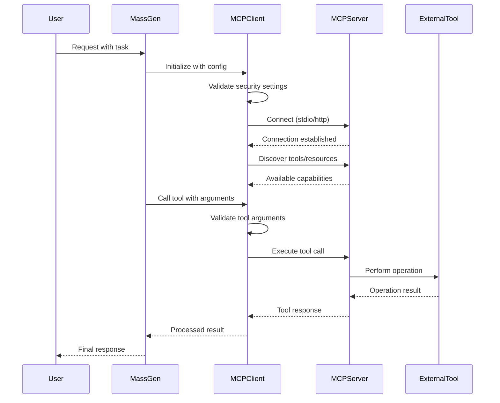

# MCP Tools Module

## Overview

**What is MCP?**
MCP (Model Context Protocol) is like a universal translator that lets AI systems safely use external tools and services. Think of it as a secure way for MassGen to connect to other programs and use their capabilities.

**What does this module do?**
The MCP Tools module is the bridge that connects MassGen to external MCP servers. It handles all the technical details of:

- Finding and connecting to MCP servers
- Discovering what tools are available
- Running tools safely with security checks
- Managing connections and handling errors

**Why do you need it?**
Instead of MassGen being limited to its built-in capabilities, MCP lets it use external tools like:

- File management systems
- Web scrapers
- Database connectors
- Code analysis tools
- API integrations
- And much more!

This module makes sure all these external connections are secure and reliable.

## Architecture



## Features

### What You Can Do

- **Connect to Multiple Servers**: Use tools from many different MCP servers at the same time
- **Automatic Tool Discovery**: The system finds and lists all available tools for you
- **Secure Operations**: Built-in security checks prevent malicious code from running
- **Reliable Connections**: Automatic reconnection if servers go down
- **Easy Configuration**: Simple YAML files to set up your servers
- **Error Handling**: Clear error messages help you fix problems quickly

### How It Connects

- **stdio**: Runs MCP servers as separate programs on your computer
- **HTTP**: Connects to MCP servers running on the web or network

### Security Protection

- **Command Safety**: Blocks dangerous commands that could harm your system
- **Network Security**: Prevents connections to unsafe websites or internal systems
- **Data Protection**: Filters out passwords and sensitive information
- **Input Validation**: Checks all data before sending it to servers
- **Configurable Levels**: Choose how strict security should be (strict/moderate/permissive)

## Quick Start

### Basic Usage

#### 1. Start a Test Server

Use the included test server for development. It provides sample tools like `mcp_echo` and `add_numbers`:

```python
# Run the test server (from massgen/tests/mcp_test_server.py)
python -m massgen.tests.mcp_test_server
```

#### 2. Configure MCP Connection

Create a configuration file or use the provided examples:

```yaml
# Based on massgen/configs/gemini_mcp_example.yaml
mcp_servers:
  test_server:
    name: "test_server"
    type: "stdio"
    command: "python"
    args: ["-m", "massgen.tests.mcp_test_server"]
    security:
      level: "moderate"
    timeout: 30
    max_retries: 3
```

#### 3. Connect and Use Tools

```python
import asyncio
from massgen.mcp_tools import MCPClient

async def main():
    config = {
        "name": "test_server",
        "type": "stdio",
        "command": "python",
        "args": ["-m", "massgen.tests.mcp_test_server"],
        "security": {
            "level": "moderate"
        }
    }

    # The async context manager connects automatically
    async with MCPClient(config) as client:
        # Discover available tools
        tools = client.get_available_tools()
        print(f"Available tools: {tools}")

        # Call a tool
        result = await client.call_tool("mcp_echo", {"text": "Hello MCP!"})
        print(f"Result: {result}")

if __name__ == "__main__":
    asyncio.run(main())
```

## Supported Transports

### stdio Transport

Direct process communication through stdin/stdout:

```yaml
type: "stdio"
command: "python"
args: ["-m", "your.mcp.server"]
# Note: type accepts "stdio" and "streamable-http"
```

### streamable-http Transport

HTTP-based communication:

```yaml
type: "streamable-http"
url: "http://localhost:8000/mcp"
headers:
  Authorization: "Bearer your-token"
# Note: type accepts "stdio" and "streamable-http"
```

## Tool Discovery and Naming

- Tools are automatically discovered upon connection
- Multi-server setups use prefixed naming: `mcp__server_name__tool_name`
- Tool names are sanitized for security using `sanitize_tool_name`
- Resources and prompts follow similar naming conventions

## Error Handling

The module provides comprehensive error handling through custom exceptions:

- `MCPConnectionError`: Connection-related issues
- `MCPServerError`: Server execution failures
- `MCPConfigurationError`: Configuration validation failures
- `MCPTimeoutError`: Operation timeouts
- `MCPValidationError`: Input validation errors
- `MCPResourceError`: Resource access failures

## Documentation

- **[Client Documentation](client.md)**: Detailed API reference and usage examples
- **[Security Documentation](security.md)**: Security features and best practices

## Troubleshooting

### Common Issues

**Connection Failures**

```
MCPConnectionError: Failed to connect to server
```

- Verify server command and arguments
- Check if the server process starts correctly
- Ensure proper permissions for stdio transport

**Tool Not Found**

```
MCPServerError: Tool 'example_tool' not found
```

- Verify tool name spelling and case
- Check if server properly advertises the tool
- For multi-server setups, use prefixed names

**Security Validation Errors**

```
MCPSecurityError: Command contains dangerous characters
```

- Review security level configuration
- Check command arguments for shell metacharacters
- Consult security documentation for allowed patterns

**Timeout Issues**

```
MCPTimeoutError: Operation timed out after 30 seconds
```

- Increase timeout values in configuration
- Check server responsiveness
- Consider using circuit breaker settings

### Debug Mode

Enable debug logging for detailed troubleshooting:

```python
import logging
logging.getLogger('massgen.mcp_tools').setLevel(logging.DEBUG)
```

## Examples

See the `massgen/configs/` directory for complete configuration examples:

- `gemini_mcp_example.yaml`: Basic single-server setup
